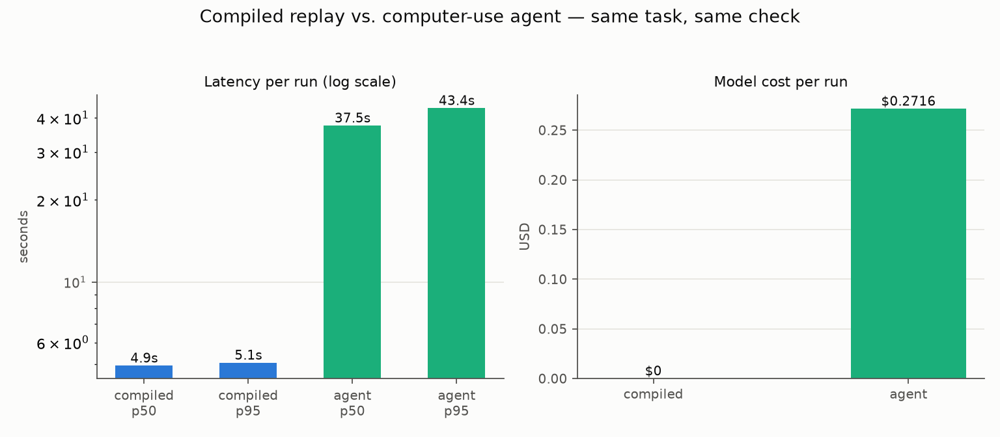

# openadapt-flow

[](https://github.com/OpenAdaptAI/openadapt-flow/actions/workflows/ci.yml)
[](https://pypi.org/project/openadapt-flow/)
[](https://pypi.org/project/openadapt-flow/)
[](LICENSE)

Record a GUI workflow once. Replay it deterministically, locally, for free.
A model only touches the script to repair it.


*Real screenshots from the two runs in [`docs/showcase/`](docs/showcase).
Left: the UI the demo was recorded on. Right: a theme it had never seen — each
step re-resolves through OCR or geometry, and each fix is written back to the
script as a reviewable diff. Zero model calls on either side.*

## Try it

```bash
pip install openadapt-flow && playwright install chromium

openadapt-flow demo-record --out rec                     # record a demonstration
openadapt-flow compile rec --out bundle --name my-task   # compile it
openadapt-flow replay bundle                             # replay: local, $0
openadapt-flow replay bundle --drift theme               # drift the UI, watch it heal
```

The last two commands serve the bundled MockMed demo app and write an
illustrated `REPORT.md` per run. Pass `--url` to replay against your own app;
recorded parameter values are the defaults and `--param` overrides them.

## How it works

Computer-use agents re-reason through your task with a large model on every
run. That's the right shape for a task nobody has automated before, and the
wrong one for the 500th referral this month. openadapt-flow compiles the
demonstration instead.

Each compiled step carries a template crop, an OCR label, geometry landmarks,
and postconditions derived from what the demo actually changed on screen. At
replay time a resolution ladder tries them in order: local template match,
global template match, OCR, landmark geometry, then (optionally) a grounding
model. Healthy scripts never leave the first rung. Milliseconds, no model
calls, no per-run cost.

When the UI drifts, a lower rung still finds the target and the fix lands in
the bundle as a diff you can review. When the screen stops matching
expectations entirely, the run halts with a report instead of guessing, and
steps tagged irreversible won't act on a low-confidence match at all.

The runtime is vision-only (PNG in, clicks and keys out) behind a small
`Backend` protocol. The reference backend is a headless browser, which is why
the whole loop runs in CI with no OS permissions. Desktop and RDP backends
are adapters to come, not rewrites.

## Proof

Every CI run records a demonstration, compiles it, and checks:

| Scenario | Outcome |
|---|---|
| Baseline replay ×3 | all steps `template` rung, 0 heals, 0 model calls |
| Theme drift | succeeds; 8/8 anchors healed; healed bundle replays clean |
| Moved buttons | succeeds via global template search |
| Renamed buttons | succeeds via landmark geometry |
| Surprise modal | fails loudly, naming the violated postcondition |
| Non-recorded parameter | substituted and verified by OCR of the final screen |

Artifacts: [baseline run report](docs/showcase/baseline-run/REPORT.md) ·
[theme-drift run report](docs/showcase/theme-drift-run/REPORT.md).

The same loop has also run against a real third-party app: the official
OpenEMR public demo (fake patients only, resets daily). An 18-step clinical
workflow — log in, find a patient, scroll a dense dashboard, add a
parameterized note — replayed **5/5 in fresh browsers with zero model
calls**, scrolling closed-loop (each SCROLL step scrolls until the next
anchor actually resolves, so content growth between runs can't displace the
targets below it). Full runs, failure analysis, and honest caveats:
[docs/showcase-openemr/FINDINGS.md](docs/showcase-openemr/FINDINGS.md).

Compiled workflows can also be emitted as Agent Skills or MCP servers
(`emit-skill` / `emit-mcp`), so other agents can invoke them.

## Benchmark



We ran the same MockMed task both ways on 2026-07-08 with the same OCR
success check: 100 compiled replays against 20 runs of a claude-sonnet-5
computer-use agent. Both arms went 100 for 100 and 20 for 20, so on an app
this simple the story isn't success rate. It's that a compiled replay
finishes in 4.9s (p50; 5.1s p95) with zero model calls, while the agent
takes 37.5s (p50; 43.4s p95) at about $0.27 per run at list price, every
run, forever. Full numbers, methodology, and caveats:
[benchmark/BENCHMARK.md](benchmark/BENCHMARK.md).

## Status

v0: 163 tests, drift matrix in CI. Solid for the reference browser backend.
`DESIGN.md` has the module contracts; `docs/L1_INTEGRATION.md` covers feeding
layered clinical-data platforms.

## Development

```bash
git clone https://github.com/OpenAdaptAI/openadapt-flow && cd openadapt-flow
pip install -e '.[dev]' && playwright install chromium
pytest -q
```

The demo GIF is generated from real run artifacts by
`scripts/make_demo_gif.py`. MIT license.
