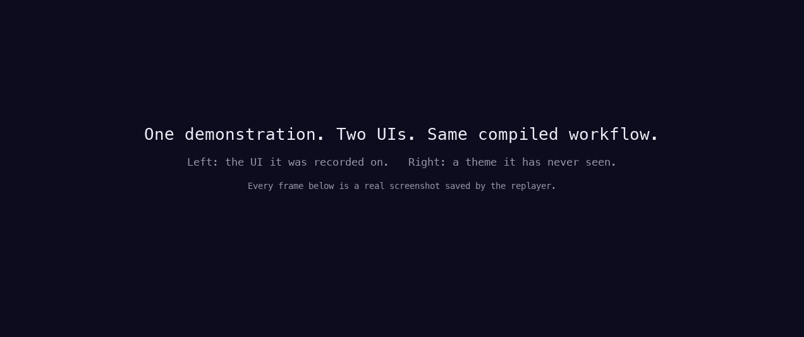
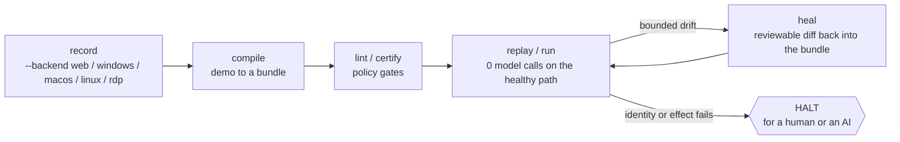
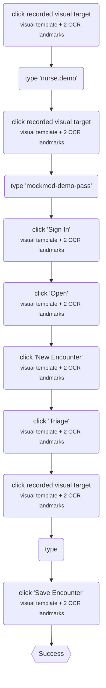

# openadapt-flow

[](https://github.com/OpenAdaptAI/openadapt-flow/actions/workflows/ci.yml)
[](https://pypi.org/project/openadapt-flow/)
[](https://pypi.org/project/openadapt-flow/)
[](LICENSE)

**openadapt-flow is the OpenAdapt engine: a governed demonstration compiler.**
Record a task once, compile it to a deterministic program, and replay that
program deterministically with zero model calls on the healthy path. Instead of
silently doing the wrong thing when an interface drifts, it re-resolves from the
evidence the demonstration retained, or it **halts** for a human or an AI, gated
by an identity check and independent effect verification. It runs entirely on
your machine; nothing egresses unless you opt in.

**Lifecycle: Beta.** See the
[capability and qualification matrix](docs/PRODUCT_STATUS.md) for workflow- and
environment-specific evidence. This is the flagship engine of the
[OpenAdapt](https://github.com/OpenAdaptAI/openadapt) project; the full docs live
at [docs.openadapt.ai](https://docs.openadapt.ai).

OpenAdapt is built for repeated workflows across every interface an operator
touches: browser pages, native Windows / macOS / Linux desktops, and
remote-display sessions (RDP, Citrix / VDI). Each target application and
environment is qualified separately. Healthy runs make no model calls. When
interfaces drift, OpenAdapt re-resolves from retained evidence or proposes a
governed repair, and halts when verification fails.



*Real screenshots from the two runs in [`docs/showcase/`](docs/showcase).
Left: the UI the demo was recorded on. Right: a theme it had never seen, where
each step re-resolves through OCR or geometry, and each fix is written back to
the script as a reviewable diff. Zero model calls on either side.*

**Verified execution.** It halts instead of guessing, and qualification reports
measure silent incorrect success, over-halt, effect confirmation, latency, and
model calls. Read the technical [limits](docs/LIMITS.md) and
[validation method](docs/validation/VALIDATION.md), including five adversarial
rounds against the wrong-target check.

## Try it

```bash
pip install 'openadapt-flow[browser]'

openadapt-flow tutorial                                  # the whole loop, VERIFIED
```

`tutorial` runs the complete free path against the bundled MockMed application
served through its real transactional backend: it records a demonstration while
observing the system of record, mines the effect contract from the record delta
it observed, certifies the bundle against the shipped `clinical-write` policy,
admits the run through the fail-closed gate under the **Standard** profile, and
verifies the write by reading the system of record out of band — a path the
application itself never calls, so the screen cannot influence it. It ends
`VERIFIED` with zero model calls, and writes a shareable `receipt.png` /
`receipt.json` beside the run.

That receipt is generated from a closed allow-list — outcomes, counts, digests,
versions — so it can carry no screenshot, OCR text, typed value, parameter,
URL, hostname, coordinate, or free-form halt reason. It carries the bundle
digest, so anyone can run the same public tutorial and compare.

To drive the same stages by hand:

```bash
openadapt-flow demo-record --out rec                     # record a demonstration
openadapt-flow compile rec --out bundle --name my-task   # compile it
openadapt-flow lint bundle                               # expected: finds demo gaps
openadapt-flow certify bundle --policy permissive        # smoke-policy pass
openadapt-flow certify bundle --policy clinical-write    # expected: strict refusal
openadapt-flow replay bundle                             # replay: local, $0
openadapt-flow replay bundle --drift theme \
  --save-healed-to healed                                # deterministic repair
openadapt-flow visualize bundle -o graph.html            # see what compiled
```

The command is `openadapt-flow`. If you installed the
[OpenAdapt](https://github.com/OpenAdaptAI/openadapt) launcher, the two-word form
`openadapt flow <args>` is equivalent and forwards every flag, including
`--backend`, to this engine.

The base `openadapt-flow` package stays lightweight for native desktop, RDP,
and Citrix runners. The `browser` extra adds Playwright only for web workflows;
the first browser command then downloads its matching Chromium build once
(about 150 MB), with no separate `playwright install chromium` step. Prefer the
canonical `pip install 'openadapt[browser]'` launcher path for normal use. In air-gapped
or CI environments that pre-provision the browser, set
`OPENADAPT_FLOW_NO_AUTO_INSTALL=1` to disable the auto-download.

The hand-driven `demo-record` bundle above is intentionally **runnable but not
certified for clinical writes**. `lint` exits nonzero because its irreversible
final click is unarmed, and `clinical-write` refuses additional identity,
system-effect, and idempotency gaps. That is the safety boundary working, not a
setup failure. The permissive policy is only a smoke gate, and `replay` runs the
**Demo** profile, whose contract asks for no effect evidence — so a Demo
completion is `COMPLETED_UNVERIFIED` and is never billable and never a success.
`tutorial` differs precisely by supplying that missing evidence: a real
persistence boundary, a mined effect contract, and an independent verifier.
Nothing in the Demo profile was relaxed to get there.

Replay serves MockMed and writes
`report.json`, an illustrated `REPORT.md`, and reviewable repair patches under
`heals/`. A healed bundle written by `--save-healed-to` is a repair
*candidate*, never an implicitly active bundle: promoting it goes through the
governed lifecycle (`openadapt-flow repair`: reviewed diff, replay + fault
campaigns, human approval, staged canary, one-command rollback). See
[docs/REPAIR_LIFECYCLE.md](docs/REPAIR_LIFECYCLE.md).

The nightly clean-machine test runs this complete install-to-uninstall journey
on Linux, macOS, and Windows. See the
[capability and qualification matrix](docs/PRODUCT_STATUS.md) for the accepted
scope of each substrate.

## Record your own app, on any substrate

`record` opens the operator's real interface and watches what you do: real
clicks, typing, key presses, and scrolls, writing the same recording format
`compile` consumes. Perform the workflow, then press Ctrl-C (or close the
window) to finish. The `--backend` selector picks the substrate, and the same
selector is available on `replay` and `run`. The browser is one surface among
six, not a privileged default: under a production profile
(`--profile standard` / `--profile regulated`) an explicit `--backend` (or a
configured `backend.kind`) is required, and a compiled bundle is bound to the
exact surface it was recorded on. Only the demo/permissive posture may default
to the browser, and it prints a visible notice when it does. See
[docs/SURFACES.md](docs/SURFACES.md) for the per-surface first-workflow paths
and the two remote execution modes.

```bash
# Browser (Playwright / Chromium): the app is a URL.
openadapt-flow record --backend web --url https://your.app --out rec
openadapt-flow compile rec --out bundle --name my-task
openadapt-flow replay bundle --backend web --url https://your.app

# Native Windows (UI Automation via the in-guest WAA agent).
openadapt-flow record --backend windows --agent-url http://localhost:5001 \
  --task "add a patient note" --out rec

# Native macOS (accessibility, one app window).
openadapt-flow record --backend macos --macos-app TextEdit --out rec

# Native Linux (AT-SPI, one exact app window).
openadapt-flow record --backend linux --linux-app gedit \
  --linux-window-title "Untitled Document 1" --out rec

# RDP remote display (pixel-only vision ladder over the network session).
openadapt-flow record --backend rdp --rdp-host 10.0.0.5 --out rec

# Citrix / VDI (one exact local Citrix Workspace window).
openadapt-flow record --backend citrix \
  --window "Citrix Viewer" \
  --rdp-window "Citrix Viewer" \
  --rdp-window-title "Ward A" \
  --rdp-readiness-text "Appointments" \
  --out rec
```

`--backend web` is browser-first (the app is a `--url`). For
`windows`, `macos`, `linux`, `rdp`, and `citrix` the capture has no field identity, so the
target is the app window or host: `--agent-url` for Windows, `--macos-app`,
`--linux-app` plus `--linux-window-title`, and `--rdp-host` (or a configured
exact `rdp_window` / `rdp_window_title` for Citrix Workspace). Pass the same `--backend`
plus target flags to `replay`, or drive a real deployment with
`openadapt-flow run bundle --config deploy.yaml`, which reads the backend,
effects, actuation, durable, and policy sections from one config. Recorded
parameter values are the defaults, and `--param` overrides them at replay.

**You don't have to name parameters up front.** The recorder passively
captures each typed field's label (DOM/accessibility, or nearby OCR on pixel
paths), and `compile` proposes a parameter named from it (`"Insurance No."`
-> `insurance_no`). Proposals are never applied silently: `compile` lists
them once for confirm / rename / mark-secret / keep-constant (on a TTY), or
non-interactively via `--accept-params insurance_no` /
`--params-from decisions.json`; unconfirmed values stay exactly as
demonstrated. An explicit `--param` always wins and suppresses the proposal.
Select `--profile regulated` for encrypted, fail-closed production execution,
`--profile standard` for a certified and durable deployment whose qualified
storage boundary may supply at-rest encryption, or `--profile demo` for an
explicitly non-production run.
Demo completions are `COMPLETED_UNVERIFIED`; Standard and Regulated return
`VERIFIED` only when every consequential effect is confirmed at the workflow's
configured minimum evidence tier. Every run also carries a first-class
`transaction_outcome` that states what is known about the business effect
(`VERIFIED`, `HALTED_BEFORE_EFFECT`, `RECONCILIATION_REQUIRED`, `FAILED_PLATFORM`,
`CANCELED`, `REJECTED_POLICY`, `COMPLETED_UNVERIFIED`) plus a per-step effect
journal.
See [execution profiles](docs/EXECUTION_PROFILES.md).

### Share a result without sharing the record

```bash
openadapt-flow report-run <run-dir> --receipt share/ --label "My first run"
```

Writes `share/receipt.png`, `receipt.json`, and `receipt.md` locally and
contacts nothing. Only a `VERIFIED` run may use the success rail, so an
unverified run still emits nothing.

The receipt is **generated from a closed allow-list, never redacted from the
run report**. Subtractive redaction of a run report is unwinnable: burned-in
pixels, OCR text captured precisely because it identifies a record, and
free-form halt reasons all leak, and one missed field is a breach. So the
receipt declares its complete field set — outcome and transaction class (closed
enums), step/heal/model-call/effect/identity counts, the over-halt counter,
duration, the resolution-rung histogram, evidence classes, substrate, versions,
the bundle and receipt digests, provenance, and an hour-truncated timestamp,
plus one optional title you type — and refuses any key outside it. There is no
screenshot, OCR text, typed value, parameter, URL, hostname, coordinate,
workflow name, or free text.

`receipt.json` is every byte that would leave the machine, so you can read it
before you post it. A receipt from the bundled tutorial is marked
`synthetic-tutorial` and contains no real data by construction; mark a real run
`--production` and route it through
`sanitize` / `review-sanitized` / `approve-sanitized` before it crosses a trust
boundary.

**Secrets never get recorded.** An `input[type=password]` field (or any field
named with `--secret <name>`) is a secret parameter: its value is never written
to the recording, the events log, the compiled bundle, or the saved frames (its
region is redacted). At replay it is injected from the environment and a missing
one fails fast:

```bash
openadapt-flow record --backend web --url https://your.app --out rec --secret password
export OPENADAPT_FLOW_SECRET_PASSWORD='…'                 # supplied at replay
openadapt-flow replay bundle --backend web --url https://your.app
```

**Compiled is not the same as certified safe.** `lint` reports a bundle's
coverage gaps (clicks that act with no identity check, steps that assert
nothing, write steps left mis-classified) with a severity each; `certify`
enforces a policy and exits nonzero, refusing the bundle before it deploys,
when it fails. Risk is auto-classified at compile time (write-shaped clicks
such as save / submit / create / delete become `irreversible`, which arms the
low-confidence refusal), and two example policies ship: a permissive default
and a strict `clinical-write.yaml`. See [docs/LIMITS.md](docs/LIMITS.md) for
what the heuristic does and does not catch.

## How it works

Computer-use agents re-reason through your task with a large model on every
run. That is the right shape for a task nobody has automated before, and the
wrong one for the 500th referral this month. openadapt-flow compiles the
demonstration instead.


```mermaid
flowchart LR
  R["record<br/>--backend web / windows / macos / linux / rdp"] --> C["compile<br/>demo to a bundle"]
  C --> G["lint / certify<br/>policy gates"]
  G --> P["replay / run<br/>0 model calls on the healthy path"]
  P -->|bounded drift| H["heal<br/>reviewable diff back into the bundle"]
  H --> P
  P -->|identity or effect fails| X{{"HALT<br/>for a human or an AI"}}
```

*Text summary (PyPI does not render Mermaid): record on any substrate, compile
the demonstration to a bundle, gate it with lint / certify, then replay or run
with zero model calls on the healthy path. Bounded drift heals back into the
bundle as a reviewable diff; an identity or effect failure halts for a human or
an AI.*

Each compiled step carries a template crop, an OCR label, geometry landmarks,
a structural locator, and postconditions derived from what the demo actually
changed on screen. At replay time a resolution ladder tries them in order: a
structural element match where the backend owns a DOM/UIA tree, then local
template match, global template match, OCR, landmark geometry, then
(optionally) a grounding model. Healthy scripts normally resolve on the first
rung. Individual deterministic resolution steps complete in milliseconds;
end-to-end workflow time depends on the target application. The healthy path
makes no model calls and incurs no per-run model cost.

When bounded UI drift preserves enough evidence, a lower rung can find the same
target and the fix lands in the bundle as a diff you can review. An optional
model may propose a repair only when explicitly enabled, and a human can teach
a guarded correction after a halt (`openadapt-flow teach`). These are different
modes, not a blanket promise of adaptation. When the screen stops matching
expectations entirely, the run halts with a report instead of guessing, and
steps tagged irreversible will not act on a low-confidence match at all.

The runtime is **vision-first**: it can operate a pure pixel surface
(PNG in, clicks and keys out), but it is not limited to pixels. Where a backend
owns a structured layer, a browser DOM or a native UI Automation / accessibility
tree, the ladder's top rung re-finds the recorded target as an *element* and
acts on it deterministically; the visual rungs are the fallback floor for
pixel-only substrates (RDP, Citrix, canvas). On a desktop drift benchmark the
structural rung resolved 21/21 targets where visual replay alone managed 6/21
([`benchmark/structural_action/`](benchmark/structural_action/STRUCTURAL_ACTION.md)).
Structure never bypasses the identity gate; it makes identity stronger, an
exact element rather than a pixel guess. But the identity gate only covers
*armed* steps, and today's bundles arm a subset of clicks (the live OpenEMR
bundle armed 4-7 of 12), so an **unarmed click has no identity check at all**.
The per-step coverage is auditable in `workflow.json` and reported in every run;
see [what it doesn't do yet](docs/LIMITS.md).

## Substrates (all first-class)

Every substrate runs on the same small `Backend` protocol and the same governed
runtime; none is a second-class add-on. Maturity is reported honestly per the
[capability and qualification matrix](docs/PRODUCT_STATUS.md):

| Substrate | Selector | Status | Evidence |
|---|---|---|---|
| Web / browser | `--backend web` | Validated | Full lifecycle on every CI build, plus third-party OpenEMR evidence |
| Native macOS (AX) | `--backend macos` | Validated | 3/3 fixed TextEdit trials with exact file-byte effects; refused a two-window ambiguity without changing either file |
| Native Windows (UIA) | `--backend windows` | Available | 3/3 fixed WinForms trials with independently confirmed SQLite effects; 3/3 refusal for both stale and ambiguous targets |
| Native Linux (AT-SPI) | `--backend linux` | Available | Required CI drives a real GTK3 workflow through an isolated X11 / session-D-Bus environment: three verified effects, plus three ambiguous-target and three stale-target refusals |
| RDP (remote display) | `--backend rdp` | Available | Real-network Aardwolf RDP into Windows 11 passed 3/3 fixed remote-input trials with independent guest-tools file verification; a separate real-FreeRDP batch covers record → compile → governed replay and refusal |
| Citrix / VDI (pixel ladder) | `--backend citrix` | Code-qualified | Dedicated exact-Workspace-window driver, readiness gate, durable resume, and 3 healthy + 3 drift-halt no-DOM trials; the retained artifact records `ica_hdx_accepted=false` until a counted ICA/HDX run is attached |

Every row is bounded to its stated evidence. Accepted application workflows are
qualified against their own controls, session/display policy, identity evidence,
and effect oracle; code-qualified Citrix deployments additionally attach the
counted ICA/HDX record for their exact Workspace/server/application matrix.
Details:
[`docs/backends/RDP.md`](docs/backends/RDP.md),
[`docs/desktop/LINUX_NATIVE.md`](docs/desktop/LINUX_NATIVE.md),
[`docs/desktop/CITRIX_PIXEL.md`](docs/desktop/CITRIX_PIXEL.md).

## Proof

Every CI run records a demonstration, compiles it, and checks:

| Scenario | Outcome |
|---|---|
| Baseline replay ×3 | all steps `template` rung, 0 heals, 0 model calls |
| Theme drift | succeeds; 8/8 anchors healed; healed bundle replays clean |
| Moved buttons | succeeds via global template search |
| Renamed buttons | succeeds via landmark geometry |
| Surprise modal | fails loudly, naming the violated postcondition |
| Non-recorded parameter | substituted and verified by OCR of the final screen |

Artifacts: [baseline run report](docs/showcase/baseline-run/REPORT.md) and
[theme-drift run report](docs/showcase/theme-drift-run/REPORT.md).

Compiled workflows can also be emitted as Agent Skills or MCP servers
(`emit-skill` / `emit-mcp`), so other agents can invoke them.

## From trace to program

A single demonstration under-specifies intent, so openadapt-flow does not stop
at replaying one. These capabilities layer onto the same $0, model-free runtime:

- **A workflow *program*, not just a line of steps.** Beyond the linear v0
  bundle, the IR (`openadapt_flow/ir.py`) expresses a parameterized program:
  states and guarded transitions, loops over worklists, subflows, typed
  parameters, predicates, and exception paths (`ProgramGraph` / `State` /
  `Transition` / `LoopSpec` / `Guard` / `Predicate` / `ParamSpec`). The flat
  trajectory is the degenerate case, so the migration is backward-compatible.
  Design: [`docs/design/WORKFLOW_PROGRAM_IR.md`](docs/design/WORKFLOW_PROGRAM_IR.md).
- **A data-driven loop from one demonstration.** `for-each` wraps a single
  linear bundle's body in one governed LOOP that runs once per record of a
  worklist (CSV or JSON), binding each record's columns to the workflow's
  parameters. Every iteration keeps the same gates: bounded by a hard
  `--max-iterations` cap, identity-checked and effect-verified per record,
  halting on an ambiguous or refuted write instead of skipping it. The
  column-to-parameter mapping is explicit and validated, so an unmapped
  column, a bound parameter with no value, or a ragged worklist fails at
  authoring time rather than emitting a bad bundle. This turns a replay of
  one recorded path into governed execution over a queue:
  `openadapt-flow for-each bundle --records worklist.csv --out queue-bundle`.
- **See what a demonstration compiled into.** `visualize` renders a
  program-graph view of a bundle before it runs: the ordered steps, the
  resolution ladder each step will try, where an identity gate is armed,
  which writes carry an effect check, and every point the run can halt. Emit
  a self-contained offline HTML page, Mermaid for docs, or the shared JSON
  graph spec that the Cloud and desktop surfaces render
  (`openadapt-flow visualize bundle -o graph.html`).
- **Multi-trace induction that refuses when it isn't sure.** `induce_program`
  aligns several demonstrations of the same task to recover the shared
  parameters, loops, and branches, deterministic and model-free at its core.
  When a branch condition or a value stays underdetermined it *quarantines* the
  program (`certified` is `False`) instead of guessing, and `disambiguate`
  surfaces the ambiguity as concrete multiple-choice questions rather than
  inventing an answer.
- **Effect verification against the system of record.** The screen can lie: an
  optimistic UI, a duplicate submit, a partial save all read as success. A step
  may declare typed `effects`, and when a run is given an `EffectVerifier` the
  replayer checks the *real* record out of band, before and after the action,
  halting on a refuted or unverifiable write, still with zero model calls. The
  oracle is pluggable: SQL, REST (`RestRecordVerifier`), FHIR
  (`FhirEffectVerifier`), or a document hash (`DocumentHashVerifier`). A
  fault-model study found the screen-only oracle silently mishandles 5 of 7
  transactional fault classes; all five halt through the real replayer once
  effects are declared ([`benchmark/fault_model/`](benchmark/fault_model/FAULT_MODEL.md),
  [`docs/design/EFFECT_VERIFIER.md`](docs/design/EFFECT_VERIFIER.md)). Two honest
  preconditions bound this: the compiler does **not** yet infer effects from a
  demonstration (they are authored per deployment against the app's system of
  record), and a run with **no** verifier configured falls back to the screen
  oracle. The net exists only when both are supplied; without them the write is
  exactly as silent as before.
- **An API actuator tier.** Where the target app exposes a real API, driving its
  GUI to make the write is the wrong tool. A step carrying an `ApiBinding`, with
  an `ApiActuator` configured, performs the write by calling the API
  deterministically and confirms it with the same `EffectVerifier`, the `api`
  leaf of the capability ladder (API, then DOM/UIA, geometry, OCR, template,
  VLM, human). It is an optimization whose safe fallback is always the GUI.
- **Policy: lint and certify.** `lint` reports a bundle's coverage gaps (unarmed
  clicks, vacuous postconditions, under-classified risk) with a severity each;
  `certify` enforces a policy and exits nonzero, refusing a bundle before it
  deploys. Runnable is not the same as certified safe. Certification is
  **optional and opt-in** (an uncertified bundle still runs), and a policy only
  defines what a bundle must satisfy, so the honest claim is that *a certified
  workflow can be configured to halt* on the conditions its policy names, not
  that any workflow always halts.
- **Governed healing.** Every fix under drift lands in the bundle as a reviewable
  diff, and a step classified irreversible will not act on a low-confidence
  match. Structure and the identity gate govern the heal; they are not bypassed
  by it.
- **Durable checkpoint / resume.** A run checkpoints verified progress
  (`openadapt_flow/runtime/durable/`) so a halt becomes a durable pause the
  operator can approve and resume from the last verified state (`resume` /
  `approve`), not a restart, and explicitly not "hand the rest to a free-form
  agent."
- **PHI-free identity.** The wrong-patient identity check can run against a
  salted-hash, shape-preserving `IdentityTemplate` instead of a plaintext
  name / DOB / MRN band, so a compiled bundle need carry no readable PHI while
  still enforcing identity (`openadapt_flow/runtime/identity_template.py`).

### What `visualize` shows

This is the actual Mermaid that `visualize` emits for the bundled MockMed
triage sample, produced by
`openadapt-flow visualize docs/showcase/bundle --format mermaid` (nothing
below is hand-drawn):


```mermaid
flowchart TD
  n0("click recorded visual target<br/><small>visual template + 2 OCR landmarks</small>")
  n1("type 'nurse.demo'")
  n2("click recorded visual target<br/><small>visual template + 2 OCR landmarks</small>")
  n3("type 'mockmed-demo-pass'")
  n4("click 'Sign In'<br/><small>visual template + 2 OCR landmarks</small>")
  n5("click 'Open'<br/><small>visual template + 2 OCR landmarks</small>")
  n6("click 'New Encounter'<br/><small>visual template + 2 OCR landmarks</small>")
  n7("click 'Triage'<br/><small>visual template + 2 OCR landmarks</small>")
  n8("click recorded visual target<br/><small>visual template + 2 OCR landmarks</small>")
  n9("type <note>")
  n10("click 'Save Encounter'<br/><small>visual template + 2 OCR landmarks</small>")
  n11{{"Success"}}
  n0 --> n1
  n1 --> n2
  n2 --> n3
  n3 --> n4
  n4 --> n5
  n5 --> n6
  n6 --> n7
  n7 --> n8
  n8 --> n9
  n9 --> n10
  n10 --> n11
  classDef irreversible stroke:#b4530a,stroke-width:2px;
  classDef halt stroke:#b21f2d,stroke-width:2px;
```

How to read the target labels:

- **`recorded visual target` is not coordinate replay.** It means the control
  had no readable label, so the bundle retained its visual crop and nearby text
  instead. The demonstration's point is only the relative offset inside the
  target after that evidence re-finds it.
- **`visual template + 2 OCR landmarks` names the retained evidence.** Replay
  resolves it on a fresh frame; global movement is accepted only when the
  landmarks do not contradict it, and ambiguous OCR refuses instead of picking
  a match.
- **DOM/accessibility is stronger when available.** Browser and native bundles
  show that structural rung instead; RDP and Citrix intentionally use the
  visual floor.
- **The HTML view carries the full contract.** `--format html` expands every
  resolution rung, identity gate, effect check, postcondition, and halt point.

*Text summary (for renderers without Mermaid): the compiled MockMed triage
bundle signs in, opens the patient, starts an encounter, enters the `<note>`
parameter, and saves it. Each click is re-found from retained evidence rather
than replayed at a literal screen coordinate.*

## Benchmark


The lead result is on a real third-party app: the official OpenEMR public
demo (fake patients only, resets daily). We ran an 18-step add-patient-note
workflow both ways (log in, find a patient, scroll a dense dashboard, add
a note) with a distinct note value each run and the same OCR success
check on both arms: 20 compiled replays against 10 runs of a
claude-sonnet-5 computer-use agent. Compiled went 20/20 at 39.2s (p50)
with zero model calls; the agent went 10/10 at 70.4s (p50), about $0.55
per run at list price ($5.52 total for the 10 runs, with prompt caching
and hard cost caps enforced in the harness). It is a shared public demo
that other users mutate and that resets daily, so it is not CI-reproducible,
and the sample is small. Correctness alone (no agent arm, 5/5 fresh browsers,
zero model calls, closed-loop scrolling) is in
[docs/showcase-openemr/FINDINGS.md](docs/showcase-openemr/FINDINGS.md).
Full numbers, methodology, and caveats:
[benchmark/openemr/BENCHMARK.md](benchmark/openemr/BENCHMARK.md).

For a controlled, CI-reproducible comparison (the methodology anchor) we
ran the bundled MockMed task both ways on 2026-07-08 with the same OCR
success check: 100 compiled replays against 20 runs of the same agent.
Both arms went 100 for 100 and 20 for 20, so on an app this simple the
story isn't success rate. It's that a compiled replay finishes in 4.9s
(p50; 5.1s p95) with zero model calls, while the agent takes 37.5s (p50;
43.4s p95). The measured agent sample cost about $0.27 per run at the model's
then-current list price; repeat-run figures are projections and exclude
authoring, maintenance, and infrastructure. Full
numbers, methodology, and caveats:
[benchmark/BENCHMARK.md](benchmark/BENCHMARK.md).

The stack also ships a pinned, containerized lending reference environment,
[`benchmark/frappe_lending/`](benchmark/frappe_lending/README.md), with pinned
containers, a lockfile, and independent REST, SQL, and exact table-delta
verification of every write. In the model-free engineering matrix (compiled
and direct-API arms, baseline plus cosmetic drift), it delivered **12/12
correct rows with zero silent wrong writes, zero over-halts, and $0 model
cost**. A separate paid-agent run completed 6/6 correct writes (5/6 clean;
one post-write cost-cap over-halt) with zero silent incorrect successes. That
small-N run used a separately provisioned baseline, so it is engineering
evidence rather than a matched comparison or publication result. See the
[aggregate agent-arm report](benchmark/agent_arm_verticals/README.md).

The silent-wrong-effect result is also packaged as a standalone, versioned,
independently runnable benchmark — **EffectBench** — that a third party can
`pip install` and run against their own agent with pydantic as the only
dependency (no OpenAdapt codebase). It defines the Silent Wrong-Effect Rate
(SWER) metric, the fault taxonomy, the oracle contract, and a leaderboard /
submission format, and ships the public synthetic MockMed sample plus the
reference scorer. Spec: [`benchmark/effectbench/SPEC.md`](benchmark/effectbench/SPEC.md);
submission format: [`benchmark/effectbench/LEADERBOARD.md`](benchmark/effectbench/LEADERBOARD.md).

## Capability and qualification

The reference browser path runs record, compile, policy-check, deterministic
replay, refusal, and report generation in CI. Windows UIA, native macOS, native
Linux, and RDP each have retained 3/3 accepted task evidence with independent
effects or oracles. Citrix has a dedicated exact-window backend and a retained
3+3 code-readiness record; an exact ICA/HDX deployment receives its own counted
qualification record rather than inheriting RDP or stand-in evidence. Each new
third-party application is similarly qualified against its controls and effect
oracle. The workflow-program
IR adds parameters, branches, loops, effect verification, and governed recovery
on the same runtime. `DESIGN.md` has the module contracts;
[`docs/design/WORKFLOW_PROGRAM_IR.md`](docs/design/WORKFLOW_PROGRAM_IR.md)
describes the program IR, and [`docs/L1_INTEGRATION.md`](docs/L1_INTEGRATION.md)
covers feeding layered clinical-data platforms.

The integrated status of the engine, browser, desktop, remote-display, safety,
GUI, hosted, and deployment surfaces is published in
[`docs/PRODUCT_STATUS.md`](docs/PRODUCT_STATUS.md). Security reviewers should
start with [`docs/ENTERPRISE_ARCHITECTURE.md`](docs/ENTERPRISE_ARCHITECTURE.md),
which maps screenshot/credential flows, cryptographic guarantees, hosted
boundaries, and unmet controls.

**Machine-checked claims.** Product claims are enforced by CI. Every registered
claim is tiered and mapped to the specific tests and benchmark artifacts that
back it in [`claims.yaml`](claims.yaml). CI runs `scripts/validate_claims.py`,
which **fails the build whenever a
claim's tier outranks its strongest evidence** and regenerates
[`docs/VERIFICATION.md`](docs/VERIFICATION.md), the claim-by-claim
verification report, from the registry, so the adjectives in this README
cannot quietly rot.

## Local-first, with an optional hosted path

openadapt-flow runs entirely on your machine. Record, compile, lint, certify,
replay, and run are all local, and the healthy replay path makes zero outbound
calls. Model grounding is off by default and only wired in behind an explicit
`--allow-model-grounding` opt-in.

OpenAdapt Cloud is the optional managed control plane at `app.openadapt.ai`.
The public managed subscription covers browser workflows today; desktop and
Citrix / VDI runs are self-hosted or on-prem. The hosted commands below connect
the locally executed compiler and runtime to that control plane for
authentication, governed artifact ingest, and PHI-minimal break reporting.

### Privacy (PHI)

For regulated deployments, PHI scrubbing on the persist/log paths is provided by
the optional `privacy` extra (Presidio-backed
[openadapt-privacy](https://github.com/OpenAdaptAI/openadapt-privacy)):

```bash
pip install 'openadapt-flow[privacy]' && python -m spacy download en_core_web_sm
export OPENADAPT_FLOW_SCRUB=on          # scrub REPORT.md + logs, fail closed
```

The shareable `REPORT.md` and console logs are scrubbed; the compiled bundle and
`report.json` keep literal identifiers on purpose (identity check + audit trail)
and are protected by a documented boundary. Identity crops sent to the on-prem
VLM appliance are deliberately not scrubbed; the control there is on-prem-only
plus no-retention. Full map: [docs/PRIVACY.md](docs/PRIVACY.md).

At rest, AES-256-GCM encryption (`OPENADAPT_BUNDLE_KEY`) seals `workflow.json`,
template crops, and durable checkpoints. It is optional for Demo and Standard
deployments with a qualified encrypted storage boundary, and required by the
Regulated profile. For an encrypted Standard bundle, the CLI carries the same
key into its durable checkpoints. KMS integration and key rotation remain
operator responsibilities, and full-disk encryption is still required. Treat
every source bundle as PHI. Details:
[docs/phi_at_rest.md](docs/phi_at_rest.md).

Seal a production candidate without modifying the compiled source bundle:

```bash
export OPENADAPT_BUNDLE_KEY='<inject from your secret manager>'
openadapt-flow seal ./bundle-v2 --out ./bundle-prod
openadapt-flow certify ./bundle-prod --policy clinical-write
```

The command copies the complete bundle, encrypts the workflow and retained
template evidence, verifies the sealed digest, and atomically publishes the new
directory. It refuses symlinks and existing destinations. Other bundle files
are copied unchanged; keep sensitive artifacts inside the workflow/templates
boundary or protect them with the deployment's encrypted volume. Sealing
changes the artifact contract, so it expires any prior certification instead
of carrying a stale decision forward. Always certify the sealed destination.
For a bundle with a qualification project, run its representative and fault
cases against the sealed destination before running `qualify certify`.

### Hosted (cloud connectivity)

Hosted commands connect the locally executed compiler/runtime to the launched
control plane at `app.openadapt.ai`: authentication, governed artifact ingest,
and PHI-minimal break reporting. Mint an ingest token in the dashboard
(`<host>/dashboard/settings/ingest`), then:

```bash
pip install 'openadapt-flow[privacy,hosted]'
openadapt-flow login --token oai_ingest_…
openadapt-flow sanitize ./my-recording --kind recording --out ./triage.sanitized
openadapt-flow review-sanitized ./triage.sanitized --original ./my-recording
# add missed redactions locally, then approve in the viewer or CLI:
openadapt-flow approve-sanitized ./triage.sanitized --original ./my-recording \
  --reviewer operator@example.com
openadapt-flow push ./triage.sanitized --kind recording

# Compile only from the approved sanitized recording, then validate locally.
openadapt-flow compile ./triage.sanitized --out ./triage.bundle --name triage
openadapt-flow lint ./triage.bundle --strict
openadapt-flow certify ./triage.bundle --policy permissive
openadapt-flow replay ./triage.bundle --url https://app.example.com/login \
  --run-dir ./triage.run --param patient_id=example

# Privacy-review the executable bytes. A changed executable is refused.
openadapt-flow sanitize ./triage.bundle --kind bundle --out ./triage.bundle.sanitized
openadapt-flow review-sanitized ./triage.bundle.sanitized --original ./triage.bundle
openadapt-flow approve-sanitized ./triage.bundle.sanitized \
  --original ./triage.bundle --reviewer operator@example.com

# Bind exact artifacts and local evidence to a one-time Cloud challenge.
openadapt-flow validate-hosted \
  --recording ./triage.sanitized --bundle ./triage.bundle.sanitized \
  --run-dir ./triage.run --policy permissive --risk-class low \
  --environment staging-v1 --target-kind web \
  --target-url https://app.example.com/login \
  --out triage.validation.json
openadapt-flow push ./triage.bundle.sanitized --kind bundle \
  --validation-attestation triage.validation.json

# Desktop/RDP/Citrix use the same validation command, deriving the signed
# target kind from report.json. Their app/window/host details stay local:
#   --target-kind citrix --environment clinic-citrix-qualified-v1
# (omit --target-url and --allowed-host outside the web substrate).

# To activate this as a new version of an existing workflow, add:
#   --workflow-id 00000000-0000-0000-0000-000000000000
# To bind that replacement to the exact halted run it repairs, also add:
#   --resolves-run-id 00000000-0000-0000-0000-000000000000

openadapt-flow report-break runs/replay-… \          # PHI-free break diagnostic
    --workflow-id <id> --deployment-kind byoc         #   -> POST /api/runs/ingest-report
```

- **Token resolution** (all outbound calls): `--token`, then
  `OPENADAPT_INGEST_TOKEN` env, then OS keychain, then an existing
  `~/.openadapt/config.toml` token (migration read). Install the `hosted` extra
  for keychain storage. New plaintext mode-`0600` storage is refused unless
  `login --allow-plaintext-token` makes the insecure fallback explicit.
- **Sanitization never mutates the original.** It inventories every file,
  applies type-specific text/image handlers to a copy, requires a stable second
  scrub pass, and writes per-file source/derivative hashes and coverage to
  `.openadapt-sanitization.json`.
- **Review is local-only by default.** `review-sanitized` binds to `127.0.0.1`,
  loads no remote assets, presents original and derivative side by side, accepts
  additional literal/rectangle redactions, and invalidates prior approval after
  every change. Administrators may opt into policy approval only for fully
  covered, stable derivatives. Automatic hosted approval additionally requires
  a deployment-allowlisted HMAC signing key; an ingest token cannot self-assert
  that policy.
- **Approval freezes exact bytes.** It creates a deterministic immutable archive
  and binds reviewer, policy, timestamp, SHA-256, and byte size. `push` sends
  those exact bytes plus the `openadapt.sanitization/v1` manifest; it never
  re-zips after approval.
- **Destination trust is independent of deployment lane.** OpenAdapt's managed
  origin is recognized explicitly. A customer-managed/BYOC endpoint requires
  HTTPS plus an exact-origin allowlist. Sanitized artifacts may upload from
  cloud, BYOC, regulated, or PHI-mode lanes; unknown destinations are refused.
- **Current coverage is text and still images.** Symlinks and database, video,
  audio, nested archive, encrypted, executable, or unknown files are refused,
  never copied through or reported as covered. See
  [docs/SANITIZED_ARTIFACTS.md](docs/SANITIZED_ARTIFACTS.md).
- **Sanitizing a bundle can break execution.** If a load-bearing target, typed
  value, identity crop, or postcondition changes, the manifest marks runtime
  semantics unvalidated and `push --kind bundle` refuses it. Parameterize PHI
  before compilation or execute the original inside its trusted boundary.
- **Runtime validation is separate from privacy approval.** It binds the exact
  approved recording and bundle, compiler configuration, parameter schema,
  strict lint, named certification, derived `low`/`consequential` risk class,
  successful report, and exact HTTPS target/host boundary to a short-lived,
  one-time tenant/token challenge. Cloud also requires exact deployment
  allowlist membership for certification policy, derived risk class, and a
  compiler version actually deployed by the runner. The HMAC proves token
  possession and envelope integrity; it is not independent observation, a
  compliance certification, or a safety SLA.
- **Halt signaling** is read from **`report.json` (`RunReport.halt` /
  `HaltObservation`)**, never from a process exit code (`replay`/`run` return
  `0`/`1` only). `report-break` posts only a schema-minimal descriptor: hashes,
  status, resolver rung, and numeric metrics. Free text, screenshots, DOM, and
  field values never enter the automatic payload. A `422` boundary rejection
  retries the same minimal shape, then falls back to local-only.
- **Opt-in post-run hook:** set `OPENADAPT_FLOW_HOSTED_WORKFLOW_ID` (and
  optionally `OPENADAPT_FLOW_DEPLOYMENT_KIND` / `OPENADAPT_FLOW_ORG_ID`) and a
  halting `replay`/`run` emits the break automatically (best-effort; never
  changes the run's exit code). Off by default.

To pair this machine with a launched Cloud tenant from a desktop deep link, use
`openadapt-flow connect`. The operator console (`openadapt-flow console`, needs
the `console` extra) serves a localhost-only, read-only web UI over compiled
bundles, run reports, halt evidence, and skill-library lineage. The sanitizer
uses the optional `privacy` extra; hosted transport uses `httpx`.

## Development

```bash
git clone https://github.com/OpenAdaptAI/openadapt-flow && cd openadapt-flow
pip install -e '.[dev]'
playwright install chromium  # optional: else auto-downloads on first launch
pytest -q
```

Contributions are welcome; see [CONTRIBUTING.md](CONTRIBUTING.md). A
ready-made first contribution: pick a module off the mypy type-debt burn-down
list (`[[tool.mypy.overrides]]` in `pyproject.toml`), tighten its annotations,
and remove it from the list.

The demo GIF is generated from real run artifacts by
`scripts/make_demo_gif.py`.

## License

OpenAdapt-authored package code is licensed under the
[MIT License](LICENSE). A Git checkout or GitHub-generated source archive also
contains an isolated openIMIS reference environment with adapted configuration
files under `AGPL-3.0-only`; the MIT license does not relicense those files.
Their exact provenance, file-local scope, and complete upstream license are
recorded in the repository-only
[third-party notice](https://github.com/OpenAdaptAI/openadapt-flow/blob/main/THIRD_PARTY_NOTICES.md).
Published PyPI wheels and source distributions exclude the openIMIS benchmark
surface and remain within the declared MIT package boundary.
