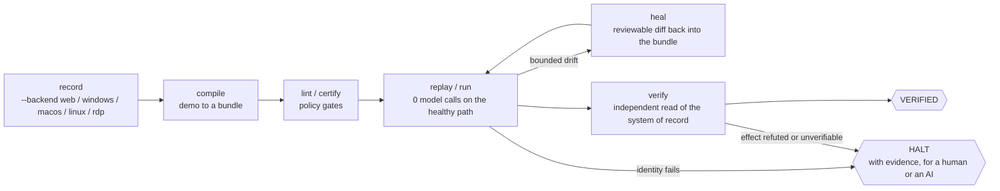

# openadapt-flow

[](https://github.com/OpenAdaptAI/openadapt-flow/actions/workflows/ci.yml)
[](https://pypi.org/project/openadapt-flow/)
[](https://pypi.org/project/openadapt-flow/)
[](LICENSE)
[](https://github.com/OpenAdaptAI/OpenAdapt)

[Try it in your browser](https://app.openadapt.ai/demo) ·
[Website](https://openadapt.ai) ·
[Docs](https://docs.openadapt.ai) ·
[Discussions](https://github.com/OpenAdaptAI/openadapt-flow/discussions) ·
[Contributing](CONTRIBUTING.md)

**openadapt-flow is the demonstration compiler and governed runtime behind
OpenAdapt.** It compiles a demonstrated GUI workflow into a deterministic,
locally executable program. Healthy runs make no model calls. When an interface
drifts, Flow re-resolves from retained evidence. A person or configured model
can propose a repair. Identity, effect, and policy checks still apply, and Flow
halts when verification fails. It runs on your machine and doesn't send data
anywhere unless you opt in.

It targets repeated workflows across every interface an operator touches:
browser pages, native Windows / macOS / Linux desktops, and remote-display
sessions (RDP, Citrix / VDI), each qualified separately.


*Real screenshots from the two runs in [`docs/showcase/`](docs/showcase). Left:
the UI the demo was recorded on. Right: a theme it had never seen, where each
step re-resolves through OCR or geometry and each fix is written back to the
script as a reviewable diff. Zero model calls on either side.*

**Verified execution.** Qualification reports measure silent incorrect success,
over-halt, effect confirmation, latency, and model calls. Two measured
comparisons, both run 2026-07-08 on the same pre-v0.2.0 source build (full
method and caveats in
[benchmarks: method, numbers, and caveats](docs/BENCHMARKS.md)):

| Task | Compiled replay | Computer-use agent |
|---|---|---|
| OpenEMR public demo, 18-step field run ([method](benchmark/openemr/BENCHMARK.md)) | 19/20 effect-verified at 39.2s median, $0 model cost; run 20 was a safe halt | 10/10 at 70.4s median, about $0.55/run |
| MockMed bundled fixture, CI-reproducible ([method](benchmark/BENCHMARK.md)) | 100/100 at 4.9s p50, $0 model cost | 20/20 at 37.5s p50, about $0.27/run |

Read the technical [limits](docs/LIMITS.md) and
[validation method](docs/validation/VALIDATION.md), including five adversarial
rounds against the wrong-target check.

## Try it

The canonical first run uses the [OpenAdapt](https://github.com/OpenAdaptAI/openadapt)
launcher, which handles Python versions, virtual environments, and shell quoting
for you:

```bash
curl -fsSL https://raw.githubusercontent.com/OpenAdaptAI/openadapt-flow/main/scripts/install.sh | sh

openadapt quickstart                                     # the whole loop, VERIFIED
```

Prefer plain pip? Two commands (quote the brackets; on Windows `cmd.exe` use
double quotes: `pip install "openadapt[browser]"`):

```bash
pip install 'openadapt[browser]'

openadapt quickstart                                     # the whole loop, VERIFIED
```

**Requirements:** Python 3.10–3.12 (3.13+ is not yet supported; the installer
provisions a suitable interpreter for you).

To work against this engine directly, run the same loop under its engine-native
name:

```bash
pip install 'openadapt-flow[browser]'

openadapt-flow tutorial                                  # same loop as `openadapt quickstart`

openadapt-flow tutorial --break-it                       # then watch it catch a lie
```

`tutorial` records a demonstration against the bundled MockMed fixture, mines its
effect contract, certifies the bundle against the shipped `clinical-write`
policy, and verifies the write by reading the system of record out of band — a
path the app never calls, so the screen cannot influence it. It ends `VERIFIED`
with zero model calls.

`--break-it` then reruns the **same certified bundle** against a backend that
lies: the server rejects the write *after* the application has painted its
success banner, so every on-screen check passes while nothing lands. The
independent read of the system of record refutes the mined `record_written`
contract. Because delivery reached the consequential step, the runtime returns
`RECONCILIATION_REQUIRED` and makes no blind retry or replay dispatch. The
caught fault's evidence is a clearly labeled local `run-broken/REPORT.md`. No
shareable receipt is emitted because only `VERIFIED` runs may use the success
rail.

Full walkthrough, including `--guided` and the hand-driven
`demo-record` / `compile` / `lint` / `certify` / `replay` stages:
[the bundled tutorial, end to end](docs/TUTORIAL.md).

## How it works

Computer-use agents re-reason through your task with a large model on every run.
That is the right shape for a task nobody has automated before, and the wrong
one for the 500th referral this month. openadapt-flow compiles instead.


```mermaid
flowchart LR
  R["record<br/>--backend web / windows / macos / linux / rdp"] --> C["compile<br/>demo to a bundle"]
  C --> G["lint / certify<br/>policy gates"]
  G --> P["replay / run<br/>0 model calls on the healthy path"]
  P -->|bounded drift| H["heal<br/>reviewable diff back into the bundle"]
  H --> P
  P --> V["verify<br/>independent read of the system of record"]
  V --> OK{{"VERIFIED"}}
  P -->|identity fails| X{{"HALT<br/>with evidence, for a human or an AI"}}
  V -->|effect refuted or unverifiable| X
```

*Text summary (PyPI does not render Mermaid): record on any substrate, compile
to a bundle, gate it with lint / certify, then replay or run with zero model
calls on the healthy path. Bounded drift heals back into the bundle as a
reviewable diff. A configured verifier reads the system of record independently:
a confirmed effect ends `VERIFIED`; an identity failure, or a refuted or
unverifiable effect, halts with evidence for a human or an AI.*

Each compiled step carries a template crop, an OCR label, geometry landmarks, a
structural locator, and postconditions derived from what the demo changed on
screen. At replay a resolution ladder tries them in order: structural element
match, local template, global template, OCR, landmark geometry, then optionally
a grounding model. Healthy scripts resolve on the first rung, in milliseconds,
with no model calls. Under bounded drift a lower rung finds the same target and
the fix lands as a reviewable diff; when the screen stops matching expectations
entirely, the run halts instead of guessing.

The runtime is **vision-first**, not vision-limited: it can drive a pure pixel
surface, and it uses the structured layer as the top rung where one exists. On a
desktop drift benchmark the structural rung resolved 21/21 targets where visual
replay alone managed 6/21
([`benchmark/structural_action/`](benchmark/structural_action/STRUCTURAL_ACTION.md)).
Structure never bypasses the identity gate, but that gate only covers *armed*
steps, and today's bundles arm a subset of clicks (the live OpenEMR bundle armed
4-7 of 12), so an **unarmed click has no identity check at all**. Rung-by-rung
detail: [the resolution ladder](docs/RESOLUTION_LADDER.md). Known gaps:
[what it doesn't do yet](docs/LIMITS.md).

## Proof

Every CI run records a demonstration, compiles it, and drives it through six
scenarios: a clean baseline, three kinds of drift it must survive, and two it
must refuse.

<details>
<summary><strong>The six CI scenarios and their outcomes</strong></summary>

| Scenario | Outcome |
|---|---|
| Baseline replay ×3 | all steps `template` rung, 0 heals, 0 model calls |
| Theme drift | succeeds; 8/8 anchors healed; healed bundle replays clean |
| Moved buttons | succeeds via global template search |
| Renamed buttons | succeeds via landmark geometry |
| Surprise modal | fails loudly, naming the violated postcondition |
| Non-recorded parameter | substituted and verified by OCR of the final screen |

</details>

Artifacts: [baseline run report](docs/showcase/baseline-run/REPORT.md) and
[theme-drift run report](docs/showcase/theme-drift-run/REPORT.md).

## Record your own app, on any substrate

Six substrates run on the same `Backend` protocol and the same governed runtime,
selected with `--backend web | windows | macos | linux | rdp | citrix` on
`record`, `replay`, and `run`. The browser is one surface among six, not a
privileged default: under `--profile standard` or `--profile regulated` an
explicit `--backend` (or a configured `backend.kind`) is required, and a
compiled bundle is bound to the exact surface it was recorded on.

```bash
openadapt-flow record --backend web --url https://your.app --out rec
openadapt-flow compile rec --out bundle --name my-task
openadapt-flow replay bundle --backend web --url https://your.app
```

- Install matrix, exact commands for all six substrates, the counted evidence
  behind each, and the two remote execution modes:
  [backends and surface support](docs/SURFACES.md).
- Attaching the recorder to a signed-in Chromium tab (SSO/2FA):
  [browser recording and CDP attach](docs/BROWSER_RECORDING.md).
- Parameters proposed from field labels, profile selection, and every run's
  `transaction_outcome`:
  [parameters, profiles, and run outcomes](docs/PARAMETERS.md).
- Secrets that never reach Python, and the exact-or-withhold rule for captured
  URLs, titles, and identity evidence:
  [secrets and the captured-evidence contract](docs/SECRETS_AND_EVIDENCE.md).
- Publishing a `VERIFIED` result with no screenshot, typed value, or URL:
  [share a result without sharing the record](docs/RECEIPTS.md).

**Compiled is not the same as certified safe.** `lint` reports a bundle's
coverage gaps with a severity each; `certify` enforces a policy and exits
nonzero, refusing the bundle before it deploys. Two example policies ship, a
permissive default and a strict `clinical-write.yaml`. See
[docs/LIMITS.md](docs/LIMITS.md) for what the risk heuristic does not catch.

## Beyond one linear trace

A single demonstration under-specifies intent, so openadapt-flow does not stop
at replaying one. These layer onto the same $0, model-free runtime, and each is
detailed in [from trace to program](docs/CAPABILITIES.md):

- **A workflow *program*** — states, guarded transitions, loops, subflows, typed
  parameters, and exception paths in the IR
  ([design](docs/design/WORKFLOW_PROGRAM_IR.md)).
- **A data-driven loop from one demonstration** — `for-each` runs a bundle once
  per worklist record, identity-checked and effect-verified per record.
- **Effect verification against the system of record** — pluggable SQL, REST,
  FHIR, or document-hash oracles. A fault-model study found the screen-only
  oracle silently mishandles 5 of 7 transactional fault classes; all five halt
  once effects are declared
  ([`benchmark/fault_model/`](benchmark/fault_model/FAULT_MODEL.md)).
- **Multi-trace induction that quarantines** rather than guesses, an API
  actuator tier, governed healing, durable checkpoint / resume, PHI-free
  identity templates, and Agent Skill / MCP emission.
- **[See what compiled](docs/VISUALIZE.md)** before it runs, and
  **[answer a halt from a phone](docs/DECISION_DELIVERY.md)** with one signed
  task carrying closed enums and no screenshot.

## Compared with agents and RPA

| | Computer-use agents | Traditional RPA | openadapt-flow |
|---|---|---|---|
| Authoring | Prompt per task | Studio flowcharts and selectors | Record one demonstration |
| Healthy-run model cost | Metered per model turn; screenshots are billed as image input each step | None, but per-seat or per-robot licensing | $0; zero model calls |
| Interface drift | Re-reasons from the screen every run, so no two runs are guaranteed alike | Selectors break; fixes are manual or a paid healing add-on | Bounded re-resolution from retained evidence; every fix is a reviewable diff |
| Success signal | The acting model reports what it sees | The session's own success signals | Independent out-of-band read of the system of record |
| On uncertainty | Keeps attempting until it believes it is done or its budget runs out | Retry policy per operator configuration | Halts with evidence; uncertain delivery is classified for reconciliation, never blind-retried |

Sourced, dimension-by-dimension comparisons against UiPath, Power Automate,
browser agents, and computer-use agents:
[openadapt.ai/compare](https://openadapt.ai/compare).

## Benchmark


The lead result is on a real third-party app: the official OpenEMR public demo
(fake patients only). An 18-step add-patient-note workflow ran both ways with
the same OCR success check. Compiled went 19/20 at 39.2s (p50) with zero model
calls; the agent went 10/10 at 70.4s (p50), about $0.55 per run at list price.
It is a shared demo that other users mutate and that resets daily, so it is not
CI-reproducible, and the sample is small. The CI-reproducible MockMed anchor,
the pinned Frappe lending reference environment (12/12 correct rows, zero silent
wrong writes), and **EffectBench** — the standalone, `pip install`-able Silent
Wrong-Effect Rate benchmark — are all in
[benchmarks: method, numbers, and caveats](docs/BENCHMARKS.md).

## Product state, qualification, and claims

Flow enters Production only through an active signed, expiring, and revocable
release admission. If that admission is missing, expired, revoked, or bound to a
different release, Flow is **not actively admitted**. A release admission does
not qualify a workflow; each workflow carries its own admission. Read the
[current admission-derived status](https://openadapt.ai/status.json) and the
[capability and qualification matrix](docs/PRODUCT_STATUS.md).

Product claims are enforced by CI: every registered claim is tiered and mapped to
the tests and benchmark artifacts that back it in [`claims.yaml`](claims.yaml),
and the build fails whenever a claim's tier outranks its strongest evidence. See
[capability, qualification, and machine-checked claims](docs/CLAIMS_AND_QUALIFICATION.md),
the generated [verification report](docs/VERIFICATION.md), and — for security
review — [`docs/ENTERPRISE_ARCHITECTURE.md`](docs/ENTERPRISE_ARCHITECTURE.md).
This is the flagship engine of the
[OpenAdapt](https://github.com/OpenAdaptAI/openadapt) project; the full docs live
at [docs.openadapt.ai](https://docs.openadapt.ai).

## Local-first, with an optional hosted path

Record, compile, lint, certify, replay, and run are all local, and the healthy
replay path makes zero outbound calls. Model grounding is off by default, behind
an explicit `--allow-model-grounding` opt-in.

For regulated deployments, PHI scrubbing on the persist/log paths comes from the
optional `privacy` extra (Presidio-backed
[openadapt-privacy](https://github.com/OpenAdaptAI/openadapt-privacy)):

```bash
pip install 'openadapt-flow[privacy]' && python -m spacy download en_core_web_sm
export OPENADAPT_FLOW_SCRUB=on          # scrub REPORT.md + logs, fail closed
```

The shareable `REPORT.md` and console logs are scrubbed; the bundle and
`report.json` keep literal identifiers on purpose (identity check + audit trail)
behind a documented boundary — full map: [docs/PRIVACY.md](docs/PRIVACY.md). At
rest, AES-256-GCM (`OPENADAPT_BUNDLE_KEY`) seals `workflow.json`, template
crops, and durable checkpoints: required by the Regulated profile, optional for
Demo and Standard. Treat every source bundle as PHI:
[docs/phi_at_rest.md](docs/phi_at_rest.md).

OpenAdapt Cloud is the optional managed control plane at `app.openadapt.ai`,
covering browser workflows today; desktop and Citrix / VDI runs are self-hosted
or on-prem. For `login`, `sanitize` / `review-sanitized` / `approve-sanitized`,
`push`, `validate-hosted`, `report-break`, `seal`, and the operator console, see
[local-first, with an optional hosted path](docs/HOSTED.md).

## FAQ

**How is this different from a computer-use agent?** For a task nobody has
automated before, an agent is the right tool. For a repeated task, re-reasoning
on every run costs money, adds variance, and never checks whether the write
landed: on the OpenEMR field run above, compiled replay went 19/20
effect-verified at $0 model cost and 39.2s median against the agent's 10/10 at
about $0.55/run and 70.4s median. Agents are the fallback, not the steady
state.

**How is this different from RPA?** RPA also replays deterministically, but it
breaks silently at drift and verifies by what the screen shows. Here drift
re-resolves from evidence retained at demonstration time into a reviewable
diff, writes are verified out of band against the system of record, and an
unverifiable run halts.

**What happens when a run fails?** It halts with a report naming the violated
expectation, and a step classified irreversible refuses to act on a
low-confidence match at all. If a backend error leaves delivery uncertain, the
run returns `RECONCILIATION_REQUIRED` for an operator to reconcile; it never
blind-retries a write. A durable run pauses at the halt and can resume from the
last verified checkpoint after approval.

**How are secrets and PHI handled?** Secret input values stay page-local: the
literal never reaches Python, the bound field region is masked in saved
frames, and replay injects the value from the environment. Everything runs
locally, and the healthy path makes zero outbound calls. Bundles can be sealed
with AES-256-GCM at rest, and the shareable receipt is generated from a closed
allow-list, so it cannot carry a screenshot, typed value, or URL.

**Is this production-ready?** Production is not a static label here. Flow
enters Production only through an active signed, expiring, and revocable
release admission; the current admission-derived state is published at
[openadapt.ai/status.json](https://openadapt.ai/status.json), and each
workflow additionally needs its own qualification with counted trials. Browser
is the strongest substrate today; Windows, macOS, Linux, and RDP carry counted
3/3 acceptance evidence; Citrix awaits a counted ICA/HDX run. See the
[capability and qualification matrix](docs/PRODUCT_STATUS.md).

## Development

```bash
git clone https://github.com/OpenAdaptAI/openadapt-flow && cd openadapt-flow
pip install -e '.[dev]'
playwright install chromium  # optional: else auto-downloads on first launch
pytest -q
```

Contributions are welcome; see [CONTRIBUTING.md](CONTRIBUTING.md). A
ready-made first contribution: pick a module off the mypy type-debt burn-down
list (`[[tool.mypy.overrides]]` in `pyproject.toml`), tighten its annotations,
and remove it from the list.

The demo GIF is generated from real run artifacts by
`scripts/make_demo_gif.py`.

## License

OpenAdapt-authored package code is licensed under the
[MIT License](LICENSE). A Git checkout or GitHub-generated source archive also
contains an isolated openIMIS reference environment with adapted configuration
files under `AGPL-3.0-only`; the MIT license does not relicense those files.
Their exact provenance, file-local scope, and complete upstream license are
recorded in the repository-only
[third-party notice](https://github.com/OpenAdaptAI/openadapt-flow/blob/main/THIRD_PARTY_NOTICES.md).
Published PyPI wheels and source distributions exclude the openIMIS benchmark
surface and remain within the declared MIT package boundary.
