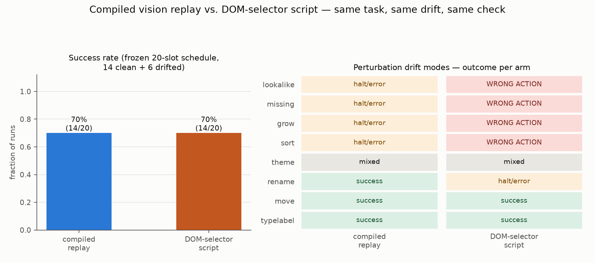

# Benchmark: compiled vision replay vs. DOM-selector script

Date: 2026-07-10. The incumbent comparison. For "run the same browser workflow
N times", the incumbent is not a computer-use agent — it is a
Playwright/Selenium script: also $0 per run, also fast, no OCR anywhere.
This benchmark runs that script head-to-head against the compiled vision
replay on the same task, the same frozen drift schedule, and the same
arm-independent success check, and reports whichever way it comes out.

**Task** (MockMed, the bundled demo clinic app; fake data only): sign in as
`nurse.demo`, open the first referral task, create a New Encounter of type
Triage, enter a parameterized note (distinct per arm and slot), save.

**The DOM arm is a steelman.** It uses Playwright's documented best
practices — `get_by_label` for fields, `get_by_role` + accessible name for
buttons, an explicit final outcome assertion, auto-waiting, standard
timeouts, no retries, no sleeps, no brittle CSS/XPath (the app exposes no
`data-testid` contract; its DOM `id`s were deliberately not used — see the
variant analysis). Every selector choice is documented in
`openadapt_flow/benchmark/dom_arm.py`.

## Verdict

**Neither a straight win nor a loss — the arms fail differently, and the difference is the finding.** On the frozen schedule the arms tie (14/20 vs 14/20): the drift conditions that halt the compiled replay (notice/reqfield/modal-once) stop the DOM script too. On wall-clock the DOM script is ~38x faster per clean run (p50 0.2s vs 7.8s). On the perturbation modes they diverge: the DOM script silently wrote to the WRONG PATIENT on 4 of 8 modes (grow, lookalike, missing, sort) — its 'first row' selector cannot tell that the row's identity changed — while the compiled arm's pre-click identity check turned all of those into safe halts or healed to the correct row (compiled wrong actions: 0). The DOM script absorbed cosmetic drift for free (move, typelabel) and broke loudly, needing a human edit, on rename (8 maintenance events overall, schedule + perturbations); the compiled arm absorbed move, rename, typelabel by healing and safe-halted on the data drifts with zero hand edits. (One condition — `theme` — produced judge-disputed verdicts: an OCR-judge artifact affecting both arms equally, not an automation difference; see the measurement-validity section.) Honest positioning, both directions: this DOM arm exists ONLY on browser backends — on desktop/VDI/Citrix substrates the comparison is unavailable, which is the criticism's own point — and where a DOM does exist, a selector script is faster and equally free, but under data drift it is the arm that writes to the wrong patient without telling anyone.



## Head-to-head on the frozen 20-slot schedule

The hybrid benchmark's exact schedule: 20 slots,
6 drifted (30% — two each of `notice`,
`reqfield`, `modal-once`), identical condition per slot index for both
arms.

| | compiled replay | DOM-selector script |
|---|---|---|
| runs | 20 | 20 |
| success rate | 70% (14/20) | 70% (14/20) |
| success on clean slots | 14/14 | 14/14 |
| success on drifted slots | 0/6 | 0/6 |
| wall-clock p50 | 8.5 s | 0.2 s |
| wall-clock p95 | 12.9 s | 30.2 s |
| wrong-action events | 0 | 0 |
| maintenance events (needs human edit) | 0 | 6 |
| model cost | $0 | $0 |

Per-condition outcomes on the schedule:

| condition | compiled replay | DOM-selector script |
|---|---|---|
| `clean` | 14/14 success | 14/14 success |
| `notice` | 0/2 success, 2 halt/error | 0/2 success, 2 halt/error |
| `reqfield` | 0/2 success, 2 halt/error | 0/2 success, 2 halt/error |
| `modal-once` | 0/2 success, 2 halt/error | 0/2 success, 2 halt/error |

## Head-to-head on the perturbation drift modes

The validation suite's drift matrix (PR #12/#13) plus `sort` and
`typelabel`; every mode is flag-gated in the MockMed app and deterministic.
One fresh browser per run.

| drift mode | compiled replay | DOM-selector script |
|---|---|---|
| `lookalike` | halt/error at `step_005` (4.7s); halt/error at `step_005` (4.5s) | **WRONG ACTION** (wrote to the wrong target; final=#patient/p0, 0.2s) x2 |
| `missing` | halt/error at `step_005` (4.6s); halt/error at `step_005` (4.5s) | **WRONG ACTION** (wrote to the wrong target; final=#patient/p2, 0.2s) x2 |
| `grow` | halt/error at `step_005` (4.7s) x2 | **WRONG ACTION** (wrote to the wrong target; final=#patient/g1, 0.2s) x2 |
| `sort` | halt/error at `step_005` (4.5s) x2 | **WRONG ACTION** (wrote to the wrong target; final=#patient/p2, 0.2s) x2 |
| `theme` | failed verification (13.6s) — but the run COMPLETED; see the measurement-validity note; success (13.5s, 8 heals) | failed verification (0.2s) — but the run COMPLETED; see the measurement-validity note; success (0.2s) |
| `rename` | success (9.7s, 2 heals); success (9.6s, 2 heals) | halt/error at `open first referral` (30.1s) — needs human edit x2 |
| `move` | success (8.3s, 2 heals); success (8.8s, 2 heals) | success (0.2s) x2 |
| `typelabel` | success (9.0s, 1 heal); success (8.7s, 1 heal) | success (0.2s) x2 |

## Wrong-action events, both arms

- **dom** on `lookalike`: wrote this run's note with the save evidence on screen but right_patient=False, wrong_type_row=False, final state `#patient/p0`
- **dom** on `lookalike`: wrote this run's note with the save evidence on screen but right_patient=False, wrong_type_row=False, final state `#patient/p0`
- **dom** on `missing`: wrote this run's note with the save evidence on screen but right_patient=False, wrong_type_row=False, final state `#patient/p2`
- **dom** on `missing`: wrote this run's note with the save evidence on screen but right_patient=False, wrong_type_row=False, final state `#patient/p2`
- **dom** on `grow`: wrote this run's note with the save evidence on screen but right_patient=False, wrong_type_row=False, final state `#patient/g1`
- **dom** on `grow`: wrote this run's note with the save evidence on screen but right_patient=False, wrong_type_row=False, final state `#patient/g1`
- **dom** on `sort`: wrote this run's note with the save evidence on screen but right_patient=False, wrong_type_row=False, final state `#patient/p2`
- **dom** on `sort`: wrote this run's note with the save evidence on screen but right_patient=False, wrong_type_row=False, final state `#patient/p2`

Totals: compiled 0, DOM
8 (schedule + perturbation runs).

## Measurement validity — where the judge itself is the weak link

The shared judge is OCR on a screenshot, and OCR can miss low-contrast text (the dark `theme` palette is the known offender). The following runs REPORTED FULL COMPLETION — every step executed, structural audit trail consistent with success — yet failed the OCR verification, with no wrong action detected. They are counted as failures in every number above (the judge's verdict stands, identically for both arms), but check the saved final screenshot in `finals/` before quoting any of them as an automation failure — on audit these are judge false negatives, not automation failures:

- compiled on `theme` (perturbation slot 28, right_patient=True): `finals/perturbation_compiled_028.png`
- dom on `theme` (perturbation slot 28, final state `#patient/p1`, right_patient=True): `finals/perturbation_dom_028.png`

## Maintenance asymmetry, stated honestly

A DOM script that drift breaks **loudly** (selector timeout, failed
outcome assertion) stays broken until a human edits the script — every
such run is counted above as a maintenance event (DOM total:
8). A DOM script that drift breaks
**silently** (wrong-action rows) is worse: it needs the same human edit
plus someone noticing the bad writes first, and every run until then
mutates the wrong record.

The compiled bundle is never hand-edited: cosmetic drift is absorbed by
the resolution ladder (heals), and non-absorbable drift ends in a safe
halt with an accurate report. That is not free either — a persistently
halting bundle needs a fresh one-minute demonstration, or an agent
fallback (see the hybrid benchmark) — but it fails closed, and the
recovery path does not involve reading someone else's selector code.

## Variant analysis — could a different DOM script dodge these failures?

Yes, partially, and it is only honest to say so:

- Keying the row selector to the app's DOM id (`#open-p1`) would survive
  `sort`/`grow`/`lookalike` and fail closed on `missing` — but `p1` is a
  DATABASE id: the script stops encoding "process the first referral in
  the queue" and starts encoding "always open patient p1", which is a
  different workflow, and id-in-selector is exactly what Playwright's
  own guidance tells practitioners not to rely on.
- Filtering the row by patient name (`get_by_role("row",
  name="Jane Sample")`) fixes the same modes at the same cost: the
  patient becomes a hardcoded constant, so the script no longer
  automates the demonstrated queue-processing task.
- Nothing in the selector toolbox fixes `notice`, `reqfield`, or
  `modal-once` without a human adding new steps — the same conditions
  that halt the compiled replay.

The steelman above therefore encodes the task as demonstrated ("first
referral"), which is also precisely what the compiled arm was recorded
doing. Where the DOM variant trade-offs land is a judgment call; the
per-condition tables give the data for either choice.

## Methodology

- **Record + compile once** (compiled arm only): the demo is recorded via
  the Playwright demo driver and compiled into a vision-anchored bundle;
  one-time, excluded from per-run latency, same as every other benchmark
  here. The DOM arm needs no demonstration — a human wrote it from the
  task spec instead (~the same one-off effort, different skill).
- **Identical environments.** Every run of both arms gets a fresh
  chromium (1280x800, deviceScaleFactor=1) against the same locally
  served MockMed app; drift is injected via `?drift=` query flags, so
  conditions are exactly reproducible.
- **Different interfaces, deliberately.** The compiled arm is
  vision-only (screenshots in, pixel clicks out). The DOM arm drives the
  page through selectors — that IS the comparison.
- **Same success criterion, implemented once.** `verify_final_state` on
  the final screenshot: OCR must find the `Encounter saved` banner AND a
  `Triage — <note>` row AND the right patient's name
  (`Jane Sample`), and this run's note must not sit in a wrong-type
  row. Neither arm's self-report is used. This is the hybrid benchmark's
  own check (`verify_hybrid_final`), reused — not a reimplementation.
- **Wrong actions measured for both arms.** The final-state identity
  check flags saves that landed on the wrong patient or wrong encounter
  type, whichever arm produced them.
- **Wall-clock** is measured around the replay / script only (browser
  and server startup excluded for both arms). DOM failures burn
  Playwright's standard 30 s auto-wait timeout before erroring; that
  cost is included, because an unattended script pays it too.
- **$0 and deterministic.** Neither arm makes a model call. MockMed's
  drift hooks are deterministic; OCR on identical frames is
  deterministic. (One known nondeterminism: under `grow`, which template
  rung fires first in the compiled arm is rendering-dependent — both
  safe outcomes are reported as measured.)

## Caveats — read before quoting these numbers

- **This arm only exists on browser backends.** That is not a footnote;
  it is the boundary of the whole comparison, and it cuts both ways. On
  desktop apps, VDI/Citrix, or anything rendered as pixels without an
  inspectable DOM, there is no selector script to write — the incumbent
  comparison is unavailable there, and the vision ladder is the only one
  of the two that runs at all. Conversely, wherever a stable DOM exists,
  the numbers above are the honest baseline the ladder has to beat.
- **MockMed is our own app**, small and clean; its accessibility (proper
  labels, roles) is BETTER than much real-world markup, which flatters
  the DOM arm's selector stability. Real EMRs bury controls in iframes
  and div-soup; both arms would degrade, plausibly at different rates.
- **The drift menu is ours too.** The schedule's three conditions were
  chosen (by the hybrid benchmark) because they halt the compiled arm;
  the perturbation modes come from the validation suite. Neither set was
  chosen to flatter or sabotage the DOM arm — it never ran against any
  of them before this benchmark — but a different drift mix would move
  the totals.
- **n = 1-2 per perturbation cell.** The hooks are deterministic, so
  these are existence results by design, not rates.
- Single machine (macOS-15.7.3-arm64-arm-64bit); local server; no network.

## Reproduce

```
.venv/bin/python -m openadapt_flow.benchmark.dom_arm --out benchmark/dom
```

No API key needed; nothing here spends money.
