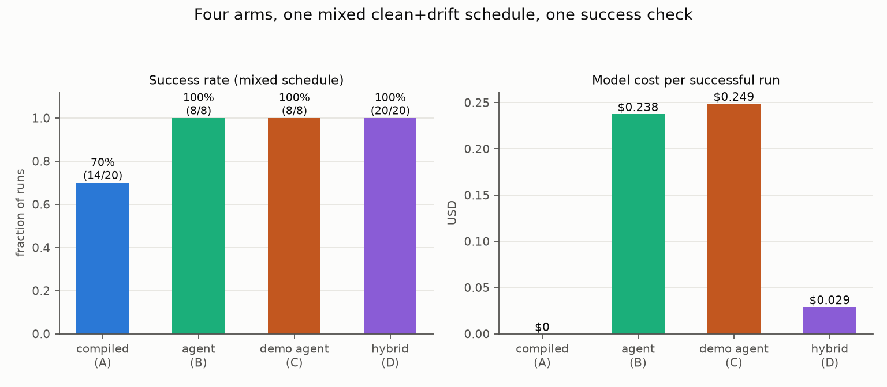

# Benchmark: does compiled-first + agent-fallback-on-halt dominate?

Date: 2026-07-09. One task, one frozen schedule of clean and drifted UI
conditions, four ways to automate it, one arm-independent success check.
Target: MockMed (the demo clinic app bundled in this repo; fake data only,
local, free, unlimited).

**Task**: sign in as `nurse.demo`, open the first referral, create a New
Encounter of type Triage, enter a parameterized note (distinct per arm and
slot), save.

**Thesis under test**: under a realistic mix of clean and drifted UI
conditions, "compiled-first with agent-fallback-on-halt" (hybrid) matches
agent-only reliability at a fraction of agent-only cost.

## Verdict

**Supported** (on this schedule): the hybrid matched or beat the best agent-only arm's success rate at a lower cost per successful run. The drift mix (30%) is an assumption — see the sensitivity note.



| | compiled (A) | agent (B) | demo agent (C) | **hybrid (D)** |
|---|---|---|---|---|
| runs | 20 | 8 | 8 | 20 |
| success rate | 70% (14/20) | 100% (8/8) | 100% (8/8) | 100% (20/20) |
| success on clean slots | 14/14 | 5/5 | 5/5 | 14/14 |
| success on drifted slots | 0/6 | 3/3 | 3/3 | 6/6 |
| wall p50 | 5.5 s | 45.0 s | 44.1 s | 5.3 s |
| wall p95 | 10.4 s | 59.1 s | 49.8 s | 35.0 s |
| model calls (total) | 0 | 108 | 108 | 40 |
| mean cost / run | $0 | $0.2377 | $0.2489 | $0.0290 |
| total cost | $0 | $1.90 | $1.99 | $0.58 |
| **cost / successful run** | $0 | $0.2377 | $0.2489 | **$0.0290** |
| wrong-action events | 0 | 0 | 0 | 0 |

Hybrid fallback detail: 6 of 20 runs
safe-halted (30% fallback rate);
6 fallbacks fired,
6 succeeded
(100% of fallbacks); mean
5.7 fallback actions and
$0.0967 fallback cost;
0 fallbacks skipped by the budget
guardrail.

Demo-conditioning finding (C vs B): success 8/8 vs 8/8; mean cost/run $0.2489 vs $0.2377 (+$0.0112); mean actions 12.5 vs 12.5. On this schedule the serialized demonstration made the from-scratch agent neither cheaper nor more reliable (the extra prompt tokens cost slightly more); its measured value showed up in the hybrid's mid-workflow fallback instead.

No wrong-action events were detected by the final-state identity check in any arm (see caveats: the detector covers wrong-patient and wrong-type writes on the final screen, not every conceivable wrong action).

Failed runs, reported honestly:

Compiled (A) — drifted slots are EXPECTED to fail here; that the failures
are safe-halts (accurate halt report, no state written) is what the
hybrid builds on:

- compiled slot 2 (notice): safe-halted at step_004 (Postconditions failed for step 'step_004' (click 'Sign In'): expected screen state not reached (semantic drift) — failed...)
- compiled slot 5 (reqfield): safe-halted at step_006 (Postconditions failed for step 'step_006' (click 'New Encounter'): expected screen state not reached (semantic drift) — ...)
- compiled slot 8 (modal-once): safe-halted at step_010 (Postconditions failed for step 'step_010' (click 'Save Encounter'): expected screen state not reached (semantic drift) —...)
- compiled slot 12 (notice): safe-halted at step_004 (Postconditions failed for step 'step_004' (click 'Sign In'): expected screen state not reached (semantic drift) — failed...)
- compiled slot 14 (reqfield): safe-halted at step_006 (Postconditions failed for step 'step_006' (click 'New Encounter'): expected screen state not reached (semantic drift) — ...)
- compiled slot 17 (modal-once): safe-halted at step_010 (Postconditions failed for step 'step_010' (click 'Save Encounter'): expected screen state not reached (semantic drift) —...)

Agent (B):

- none

Demo agent (C):

- none

Hybrid (D):

- none

## The drift schedule (designed before spending)

20 slots, 6 drifted
(30%), frozen before any paid run. Arms A and D
run all slots; arms B and C run the 8-slot
subsample [0, 2, 4, 5, 8, 10, 15, 18] (5 clean + one of each drift type).
Every arm sees the identical condition at the same slot index.

Disclosure: the B/C agent subsample is 3/8 = 37.5% drift versus the 20-slot schedule's 30% — drifted runs cost more, so the agent-only mean is measured on a slightly drift-heavier mix than the hybrid arm ran: a small cost bias in the hybrid's FAVOR of about $0.00239/run (B mean $0.23770 measured vs ~$0.23530 reweighted to the schedule mix; cost-per-run ratio 8.2x measured vs 8.1x reweighted). Conclusions unchanged.

| condition | what changes | compiled halt point (probed free, 3/3 deterministic) | intent-level recovery |
|---|---|---|---|
| `notice` | a "What's New" interstitial replaces the tasks screen after sign-in until dismissed | Sign In click (postcondition: tasks screen never appears) | click "Continue to tasks" |
| `reqfield` | the encounter form gains a required Acuity field; saving without it shows a validation error | New Encounter click (postcondition: form region changed) — halts BEFORE anything is typed | select an acuity, then save |
| `modal-once` | a survey modal intercepts the FIRST save click; after dismissal saving works | Save Encounter click (postcondition: saved banner never appears) | dismiss the modal, save again |

Conditions probed and REJECTED because the compiled arm absorbs them
(the resolution ladder heals through and the run completes correctly —
verified against final-state identity, not just the run's own flags):
`theme` (dark palette; 8 heals), `rename` (button relabels; 2 heals),
`move` (relocated buttons; 2 heals), and `typelabel` (Triage segment
relabeled "Triage Assessment" AND segment order swapped; healed via the
OCR rung and saved the correct Triage encounter for the correct patient,
3/3). Drift that a compiled replay heals through cannot exercise the
fallback; only drift it HALTS on can.

## Sensitivity: the 30% drift mix is an assumption

Let `d` = the fraction of runs that hit compiled-halting drift, `f` = the
mean fallback cost per halted run (measured here:
$0.0967), and `a` = the agent-only mean cost per run
(measured here: $0.2377). Expected hybrid model cost per run is
`d x f` (clean runs are $0) versus `a` for agent-only:

- at `d = 0` (no drift): hybrid cost is $0 per run;
- at `d = 1` (every run drifts): hybrid cost approaches `f` per run plus
  the halt-detection wall-clock overhead (~5-10 s of postcondition
  timeout per halt here);
- break-even: hybrid is cheaper than agent-only whenever `d x f < a`,
  i.e. for every `d` up to `a / f` = 2.5.
  When `f <= a` (a mid-workflow fallback is no dearer than a full agent
  run), the hybrid is cheaper at EVERY drift rate.

## Methodology

- **Record + compile once.** The demo is recorded via the Playwright demo
  driver and compiled into a vision-anchored bundle; recording/compiling
  is a one-time cost excluded from per-run latency (same as the earlier
  benchmarks).
- **Identical environments.** Every run of every arm gets a fresh
  chromium browser + page against the same locally served MockMed app
  (state lives in the page). Drift is injected via MockMed's `?drift=`
  query flags, so conditions are exactly reproducible.
- **Same interface.** All arms drive the same `PlaywrightBackend`,
  vision-only: screenshots in; pixel clicks, typed text, key presses out.
- **Agent arms.** Model `claude-sonnet-5` with the
  `computer_20251124` computer-use tool (beta header
  `computer-use-2025-11-24`), prompt caching on, history bounded to the
  last 3 screenshots, 25-action budget (B, C)
  and 15-action budget for D's mid-workflow
  fallback. Arm B's prompt states user intent only. Arm C's prompt = B's
  plus the serialized demonstration (action type + human-readable target
  per step, `<note>` placeholder, NO coordinates). D's fallback prompt =
  intent + serialized demo + "steps 1..k reported complete, halted at
  step k+1 because <reason>", continuing in the replayer's own browser
  session.
- **Same success criterion, implemented once.** `verify_hybrid_final` on
  the final screenshot: OCR must find the `Encounter saved` banner AND
  the `Triage — <note>` row AND the right patient's name, and this run's
  note must not appear in a wrong-type row. No arm's self-report is used.
- **Distinct note per (arm, slot)** so a pass proves parameter
  substitution against the run's own value.
- **Cost** from API `usage` token counts at list pricing
  ($3.00 /
  $15.00 per MTok in/out;
  cache writes 1.25x, cache reads 0.1x input). An introductory $2/$10
  rate applies through 2026-08-31, so billed cost today is roughly a
  third lower than reported.
- **Hard cost guardrails.** One shared budget across ALL paid runs (B, C,
  and D's fallbacks): preflight probe before any spend; per-run cap
  $1.50; total ceiling $8.00 enforced
  before every paid run (trips are disclosed, never raised); two
  consecutive auth/billing errors abort paid spending; every finished run
  appends to `rows.jsonl`. Total recorded spend at list price:
  **$4.47**.

## Caveats — read before quoting these numbers

- **The hybrid's reliability is bounded by halt-DETECTION reliability.**
  Fallback fires only on DETECTED halts. The validation suite
  (`docs/validation/VALIDATION.md` on `feat/validation-suite`, PR #12)
  documents silent wrong-action modes in the compiled replayer —
  lookalike/imposter rows clicked with high template confidence, deleted
  targets resolving to a neighbouring row, rows inserted above shifting
  the target, and focus theft silently dropping typed text — which
  produce a green report with a wrong or empty write and would BYPASS the
  hybrid's fallback entirely. The dominance claim, to whatever extent
  supported above, applies ONLY to detected-halt drift. This benchmark's
  success check verifies final-state identity (right patient, right
  type, the run's own note) precisely because the replayer's self-report
  is not sufficient.
- **Selection bias in the drift conditions, by construction.** The three
  drift conditions were chosen BECAUSE free probe runs showed they make
  the current bundle safe-halt deterministically (and remain completable
  at the intent level). Drift that the ladder absorbs (theme, renames,
  moves) is under-represented — on such drift the hybrid is identical to
  the compiled arm at $0. Real-world drift mixes will contain all three
  classes (absorbed / detected-halt / silent-wrong) in unknown
  proportions.
- **MockMed is our own app**, built simple and high-contrast; both the
  drift hooks and the workflow are synthetic. Treat this as a controlled
  experiment on the ORCHESTRATION policy, not a field result.
- **Small agent Ns** (8 per paid arm; 6
  hybrid fallbacks): success rates carry wide error bars; single-run
  differences are within noise.
- **The 30% drift fraction is an assumption** — see the sensitivity note
  and break-even formula above.
- **The compiled arm needs a demonstration first** (about a minute of
  human demonstration, one-time). The agent arms need only the prompt;
  arm C and D's fallback also consume the demonstration, serialized.
- **Model version pinned**: `claude-sonnet-5` with
  `computer_20251124` on 2026-07-09.
- Single machine (macOS-15.7.3-arm64-arm-64bit); local server; no network
  variance except the Anthropic API round trips in paid runs.

## Reproduce

```
.venv/bin/python -m openadapt_flow.benchmark.hybrid_benchmark --out benchmark/hybrid
```

Requires `ANTHROPIC_API_KEY` (or `~/.anthropic/api_key`). The paid arms
cost real money ($4.47 at list price when this
was generated; billed cost is lower under the intro rate). The compiled
arm and the drift probes are free.
