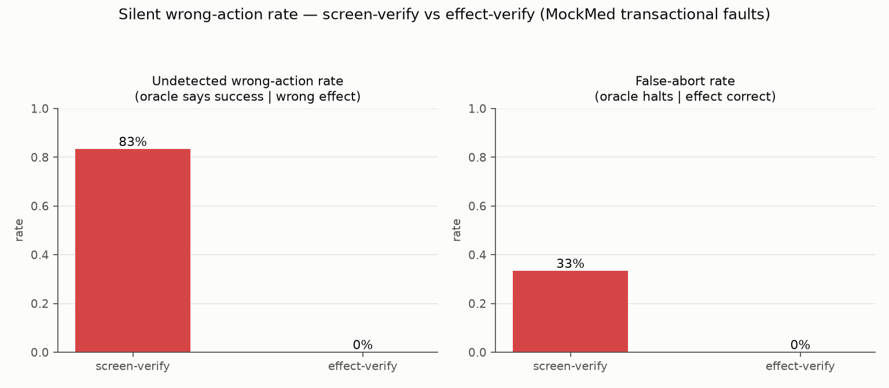

# Silent-wrong-action rate: screen-verify vs effect-verify (measured)

Date: 2026-07-13. This is the [silent wrong-action rate
instrument](../../docs/validation/SILENT_WRONG_ACTION_RATE.md) reduced to a
number and pointed at our OWN runtime — the transactional fault-class matrix
(`tests/test_effect_fault_matrix.py`) turned into a measured metric. Every
figure below comes from actually running the MockMed transactional-fault
suite (`mockmed.fault_server`) 10 times per scenario
and reading the real system of record; nothing is hardcoded. No model calls,
localhost only.



## Headline

Over **90 runs** across 9 transactional
fault scenarios (60 of which produced a genuinely wrong /
absent / duplicate business effect, judged independently against the system of
record):

| metric | screen-verify (weak oracle) | effect-verify (#63) |
|---|---|---|
| **silent-wrong-action rate** (wrong effect ∧ oracle says success, over all runs) | **55.6%** (50/90) | **0.0%** (0/90) |
| **undetected-wrong rate** (oracle says success \| a wrong effect occurred) | **83.3%** | **0.0%** |
| **false-abort rate** (oracle halts \| the effect was correct) | 33.3% (10 run(s)) | 0.0% (0 run(s)) |

The screen oracle silently passes a wrong write in **83%**
of the runs where one occurred; the effect verifier drives that to
**0%** by reading the record instead of the
pixels — and, as a bonus, converts the screen's `timeout` false-abort (the row
landed but the screen reported failure) into a correct CONFIRMED, so it also
has the lower false-abort rate.

## Per-scenario detail

Verdicts are deterministic per fault class (a `MIXED:` marker would flag any
run-to-run disagreement); N proves reproducibility.

| scenario | ground-truth effect | screen-verify | effect-verify | silent under screen? |
|---|---|---|---|---|
| `ok` | correct | pass | confirmed | — |
| `partial` | WRONG (wrong_field) | pass | refuted | YES — silent wrong-action |
| `optimistic` | WRONG (absent) | pass | refuted | YES — silent wrong-action |
| `duplicate` | WRONG (duplicate) | pass | refuted | YES — silent wrong-action |
| `double` | WRONG (duplicate) | pass | refuted | YES — silent wrong-action |
| `stale` | WRONG (collateral_loss) | pass | refuted | YES — silent wrong-action |
| `timeout` | correct | fail | confirmed | — |
| `session` | WRONG (absent) | fail | refuted | — |
| `idempotent` | correct | pass | confirmed | — |

## What each column means

- **ground-truth effect** — computed straight off the system-of-record store
  (before vs after), never from an oracle. `correct` = exactly one `p1` /
  `Triage` encounter with this run's note and no pre-existing row destroyed.
- **screen-verify** — the documented `app.js` "saved banner" rule applied to
  the real server response(s): the weak, vision-style oracle. It `pass`es for
  every one of the five silent classes (`partial`, `optimistic`, `duplicate`,
  `double`, `stale`) — a partial save, a phantom optimistic success, a
  double-write, and a lost update all leave the banner painted.
- **effect-verify** — the #63 `RestRecordVerifier` consequential-save contract
  (`record_written` exactly once AND `field_equals` on the note) against
  `GET /api/db`. It `refuted`s every wrong effect and `confirmed`s the clean
  control, the idempotent fix, and the committed-then-timed-out write.

## Reproduce

```
.venv/bin/python -m openadapt_flow.benchmark.silent_wrong_action \
    --out benchmark/silent_wrong_action --n 10
```

Serves `mockmed.fault_server` locally, drives each fault scenario, and reads
the real store. $0, no network beyond localhost, no model calls. The
qualitative claim (screen-verify has a nonzero silent rate; effect-verify
drives it to zero) is pinned in CI by
`tests/test_silent_wrong_action_benchmark.py`.
