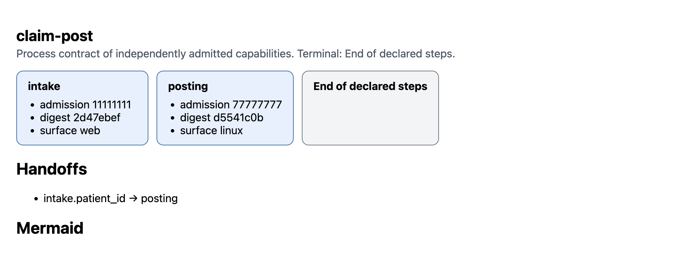

# Process contracts

A process contract sequences independently admitted capabilities. Each child
already carries its own `openadapt.qualification-admission/v1` envelope: one
workflow version, one bundle digest, a counted campaign, identity and effect
contract digests, a 30-day lifetime, signed Ed25519.

The parent names which of those capabilities run, in which order or DAG, which
confirmed effect-bound facts may copy as handoffs, and which halt classes it
will absorb. It does not become a bigger `ProgramGraph`.

## Compose is recordings. This is admissions.

`openadapt-flow compose` sequences compiled recordings into `composition.json`
and copies the children. That's the right tool when you recorded two surfaces
and haven't admitted them yet.

`openadapt-flow process` writes `process-contract.json` and *points at*
already-admitted artifacts. It will not copy recordings the way compose does.
Pointing it at a compose output that has no envelopes fails the admission
check. That refusal is the product.

If you installed the launcher, `openadapt flow process` is the same command.

## Author after you record, qualify, and admit

Do this once per surface:

1. Record and compile the workflow on that surface.
2. Qualify it. The campaign has to report `over_halt` and
   `silent_incorrect_success`.
3. Admit that exact bundle digest. Keep the signed envelope.

Then author the parent:

```bash
openadapt-flow process \
  --child intake=./intake-bundle \
  --admission intake=./intake-admission.json \
  --child posting=./posting-bundle \
  --admission posting=./posting-admission.json \
  --handoff intake.patient_id=posting.patient_id \
  --out process
```

`--after NAME=PRED` declares a DAG. Default order is `--child` order. Cycles
refuse at authoring.

`--allow-halt NAME=OUTCOME` lets the parent absorb that child ending
`OUTCOME` and continue. The halted child still mints no facts.

`--input NAME` lists parent-level parameter names. Values arrive at run time.

Authoring also refuses one child, unknown names, a handoff whose source isn't
bound by the source child's effect contract, a handoff that points backwards,
and a digest that doesn't match the envelope.

## Run, certify, replay

```bash
openadapt-flow certify process --policy clinical-write
openadapt-flow run process --config deploy.yaml
```

`run` verifies each child's envelope against the live run (signature, validity
window, revocation, every digest in the payload) and then calls Execute. That's
governed `run`, not raw `replay`.

`openadapt-flow replay process` refuses. Replay of a process parent is not a
supported path.

Signer trust comes from `qualification-trust.json` beside the parent, or from
`OPENADAPT_QUALIFICATION_TRUST`. Don't put a test Ed25519 key in a production
trust map.

## Visualize the parent

```bash
openadapt-flow visualize process --out process.html
openadapt-flow visualize process --format mermaid
openadapt-flow visualize process --format json
```

You get one node per admitted child (name, short admission id, short digest,
surface if known). Kind is `admitted_capability`. Edges follow the DAG or list
order. Handoff edges are labelled with the effect-bound param names. The
terminal title is **End of declared steps**. It is never Success.

This is the HTML visualizer `openadapt-flow visualize process` writes for a
two-child process with a `patient_id` handoff:



Open the same page offline: [showcase-process/program-graph.html](showcase-process/program-graph.html).

The HTML is self-contained. The JSON schema is
`schemas/process-contract-graph-v0.json`. Two capabilities do not get merged
into one `ProgramGraph`.

## Receipt

A parent run writes `process-report.json`. It names both `admission_id`s, both
bundle digests, the handoff (values stored as `"<bound>"`), `halted_at`, and
the model-call count.

Window titles, URLs, and OCR do not appear. They aren't evidence.

The parent is `VERIFIED` only if every child is `VERIFIED` and total
`model_calls` is 0. Otherwise you get `COMPLETED_UNVERIFIED` or the last halt
or fail.

## What HALTs

- A child whose envelope is missing, expired, revoked, or bound to a different
  digest.
- A handoff fact the predecessor didn't confirm on its effect contract.
- A predecessor that didn't end `VERIFIED`, unless you named that class in
  `--allow-halt`.
- A child Execute that isn't `VERIFIED`, for the same reason.

A model call on any child forbids parent `VERIFIED` even if every child
finished.

This path does not claim Production, live Citrix, FHIR, MCP, or a backend
switch. Each child runs on the surface it was admitted on.
