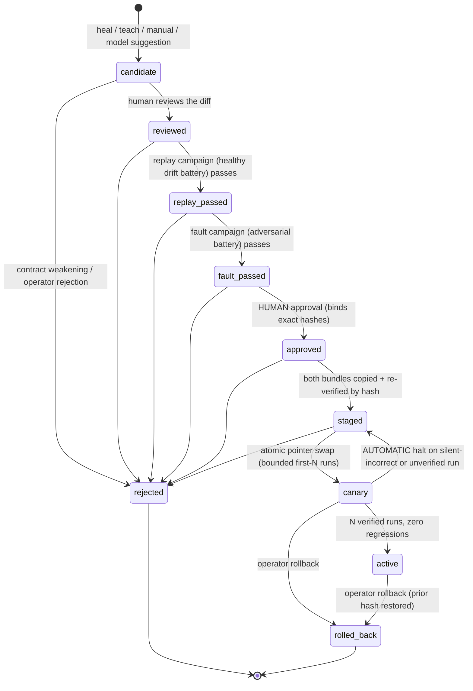

# Governed repair promotion lifecycle

A heal or a taught correction produces a PROPOSED bundle. Under the governed
lifecycle (roadmap Section 9), that proposal is never the active bundle just
because it exists on disk: it becomes a **repair candidate** that must earn
activation through explicit, auditable, fail-closed gates.

Package: `openadapt_flow/repair/` (candidate model, contract invariants,
campaigns, lifecycle store, CLI). Tests: `tests/test_repair_lifecycle.py`.

## The state machine



Anything not drawn above is an illegal transition and is refused
(`RepairLifecycleError`). A candidate can never skip a gate.

## How a repair enters the lifecycle

Where a repair used to become usable immediately, the engine now ALSO writes a
detached candidate record (`repair/candidate.json`) inside the proposed
bundle:

- **Heal path** (`openadapt_flow/runtime/replayer.py`): a replay with
  `--save-healed-to` still runs each heal through the existing in-run
  regression gate (`openadapt_flow/runtime/healing/`), and still writes the
  healed bundle at the end. That healed bundle is now registered as a repair
  candidate (source `heal`) with the run's heal evidence attached.
- **Teach path** (`openadapt_flow/learning/teach.py`): a promoted taught
  bundle is registered as a repair candidate (source `teach`).

Registration failure fails CLOSED by absence: a proposed bundle without a
candidate record cannot enter the lifecycle at all.

The candidate record is **privacy-safe by construction**: binding values are
stored as SHA-256 digests, failure evidence as path + hash references, and
failure fingerprints as structured labels plus digests. No raw observation
(frame, OCR text, identity band) enters the record, so candidates can sync to
Desktop / runners / Cloud.

## What a candidate records

- the changed binding: per-step, per-field anchor diffs (values digested)
- why the old binding failed: failure fingerprints
  (`step_id` + bounded `failure_class` + evidence digest) and evidence refs
  into the run directory (`heals/<step>/patch.json`, `report.json`)
- what supports the new binding: campaign results, the approval record,
  canary metrics
- lineage: prior and proposed whole-bundle content digests (the same digests
  `BundleManifest.content_digest` seals), the qualification environment
  contract hash (compatibility scope), and the full transition history

## The gates

### 1. Reviewed diff

`repair review` records a human reviewer. `repair show` renders the diff
summary; the full value-level diff is rendered live from the two local
bundles, never stored in the candidate.

### 2. Replay campaign (healthy cases)

The repaired binding is replayed against the evidence frame plus the reused
deterministic drift battery (`openadapt_flow/runtime/healing/perturbation.py`:
shift, scale, retheme, reflow). Every case must locate the target AND verify
its identity band.

### 3. Fault campaign (adversarial cases)

The repaired binding is replayed against `openadapt_flow/repair/campaign.py`'s
adversarial battery: **ambiguity** (duplicated target on the same row),
**wrong entity** (the identity band names someone else), **stale target**
(the control is gone), **unexpected dialog** (a modal covers the target), and
**verifier failure** (the band is unreadable). Every case must be REFUSED:
either the resolver finds nothing (or raises a refusal), or the identity band
fails verification so the pre-click gate halts. Confidently acting on any
fault frame is a silent wrong action and fails the campaign. An unarmed
binding (no identity band) that acts on an adversarial frame always fails.

Both campaigns are recorded on the candidate; a failed campaign never
advances the state and approval refuses until both pass.

### 4. Contract invariants (fail closed, checked twice)

`openadapt_flow/repair/invariants.py` diffs the prior and proposed bundles'
safety contracts and HARD-REFUSES any weakening of:

- **identity**: lost anchor evidence tiers, removed identity policies,
  lowered quorums, removed signals, changed enforcement
- **effect**: dropped step effects, weakened minimum effect tier, removed or
  weakened effect verification policies
- **risk**: `irreversible -> reversible`, dropped `consequential`, removed
  steps, downgraded or de-confirmed risk classifications
- **environment**: any change to the qualified environment boundary, removed
  required capabilities
- **policy**: removed qualification project, removed requalification
  conditions, grown exclusions

The only path through is an **explicit new qualification revision** on the
proposed bundle (`qualification.revision` strictly advanced and chained via
`previous_revision_sha256`, i.e. produced by the reviewed qualification
APIs). The check runs at registration (a weakening candidate is created
already `rejected`) and again at approval against the bundles on disk.

### 5. Human approval

`repair approve` requires a human identity and refuses unless the state is
`fault_passed` with both campaigns green. The approval record binds the EXACT
prior and proposed content digests. For automation there is
`--non-interactive`, which still requires an explicit `--approved-by` human
identity; automation may never approve on its own authority.

### 6. Staged, canary, active (atomic, hash-verified)

`repair stage` copies BOTH bundles into the store under
`bundles/<content-digest>/` and re-verifies each copy byte-exact (the prior
bundle too, so rollback is always local). `repair canary` atomically swaps
the active pointer (`ACTIVE.json`, written via temp file + `os.replace`)
to the proposed digest, in `canary` mode, after re-verifying the staged copy.
A tampered staged bundle refuses activation.

The canary window is bounded (`--max-runs`, default 5): each run is recorded
(`repair canary-record --run-dir <run>`), distilled to two triggers via
`observation_from_report` (fail-safe: an unknown outcome counts as a
regression):

- **silent-incorrect**: `COMPLETED_UNVERIFIED` / `RECONCILIATION_REQUIRED`
  transaction outcomes, or a step observing a conflicting business effect
- **verification regression**: any non-`VERIFIED` outcome

Either trigger IMMEDIATELY reverts the pointer to the prior digest and drops
the candidate back to `staged`. After N fully verified runs the candidate
completes to `active`.

### 7. Rollback

`repair rollback` is one command: it restores the prior content digest as the
active pointer (verified against the staged prior copy) and marks the
candidate `rolled_back`. Lineage stays in the candidate history.

## Hard rule: models never actuate or self-promote

Every lifecycle transition asserts the acting party is not a model
(`assert_not_model_actor`); `review` and `approve` additionally require a
human. A runtime model suggestion may only produce a candidate (source
`model_suggestion`) that flows through the SAME human-gated path. This is
enforced in code and covered by tests
(`test_model_actor_cannot_perform_any_transition`,
`test_model_suggestion_source_still_requires_full_human_gate`).

## Sync and fingerprints

The approved / staged / active states are identified by exact whole-bundle
content digests, so Desktop, runners, and Cloud can sync deterministically:
fetch `bundles/<digest>/`, re-verify the digest locally, and trust nothing
else. `RepairCandidate.record_sha256()` digests the full candidate record for
the same purpose. Failure fingerprints in the candidate are privacy-safe
(labels + digests only).

## Store layout

```
repair-store/
  candidates/<candidate-id>.json   # the candidate records (atomic writes)
  bundles/<content-digest>/        # immutable staged copies, by hash
  ACTIVE.json                      # atomic active pointer + lineage
```

## CLI reference

All commands accept `--store DIR` (default `repair-store/`).

| Command | Purpose |
| --- | --- |
| `openadapt-flow repair register <proposed> --prior <bundle> [--source heal\|teach\|manual\|model_suggestion] [--evidence <run-dir>]` | Register a bundle pair as a candidate (or import the detached `repair/candidate.json` when `--prior` is omitted). Refuses contract weakenings. |
| `openadapt-flow repair list` | List candidates and lifecycle states. |
| `openadapt-flow repair show <id> [--json]` | Reviewable diff, campaigns, approval, canary metrics. |
| `openadapt-flow repair review <id> --reviewed-by <name>` | Record the human diff review. |
| `openadapt-flow repair campaign <id> --kind replay\|fault` | Run a campaign against the candidate's evidence frames with the production resolver + OCR. |
| `openadapt-flow repair approve <id> [--approved-by <name>] [--non-interactive]` | Human approval; `--non-interactive` requires an explicit `--approved-by`. |
| `openadapt-flow repair stage <id>` | Stage both bundles by hash and re-verify byte-exact. |
| `openadapt-flow repair canary <id> [--max-runs N]` | Atomically activate in canary mode. |
| `openadapt-flow repair canary-record <id> --run-dir <run>` | Record one canary run; auto-revert on regression; auto-complete to active after N verified runs. |
| `openadapt-flow repair rollback [--candidate-id <id>] [--by <name>]` | One-command rollback to the prior hash. |
| `openadapt-flow repair status` | Show the active pointer and its lineage. |

## Relationship to the in-run heal gate

The existing in-run governance (`openadapt_flow/runtime/healing/`: the
identity-never-weakened `RegressionGate`, quarantine, and perturbation
harness) still guards each heal DURING a run: a weakening heal quarantines
and halts the run exactly as before. This lifecycle governs the next level
up: whether the resulting proposed BUNDLE may ever replace the active one.
The in-run gate protects the run; the lifecycle protects the fleet.
