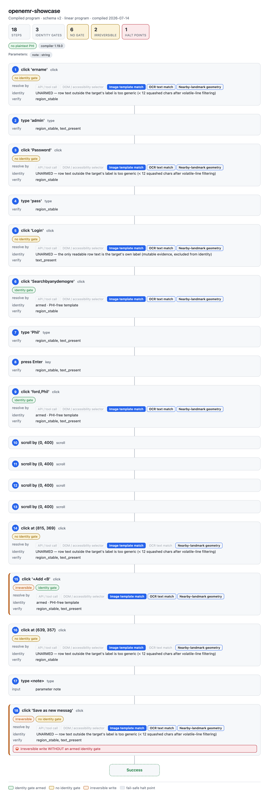

# Compiled-program visualizer

See what a demonstration compiled **into**. A compiled bundle is not a video —
it is a governed program: an ordered set of steps, each carrying how its target
is re-resolved, whether an identity gate protects the click, what real
system-of-record effect must hold, what the screen must look like afterward, its
risk class, and where the run will **halt** rather than guess. The visualizer
renders that structure.



## One spec, three surfaces

The engine is the single source of truth. `openadapt_flow.visualize`
**emits a serializable _program-graph spec_** from a compiled bundle; every
surface renders that spec and none of them re-parse the bundle IR:

- **CLI** (`openadapt-flow visualize`) — self-contained HTML / Mermaid / JSON.
- **Cloud** (`app.openadapt.ai`) — an interactive React view over the same spec.
- **Desktop** (Tauri app) — a view that vendors the same renderer.

The spec is versioned and has a committed JSON Schema
(`schemas/program-graph-v1.json`) so non-Python surfaces validate the same
shape. A sample emitted spec lives at
[`docs/showcase-openemr/program-graph.json`](showcase-openemr/program-graph.json).

### Spec shape (v1)

```
ProgramGraphSpec
├─ spec_version
├─ bundle: BundleMeta      # name, schema version, PHI/encryption flags,
│                          # provenance/certification, params, rollup counts
├─ nodes: [GraphNode]      # one per compiled step / program state
│   ├─ kind                # action | branch | loop | subflow_call | terminal
│   ├─ title, action, risk # intent, click/type/…, reversible|irreversible
│   ├─ resolution          # the target-resolution LADDER + which rung is top
│   ├─ identity            # armed? phi-free? unarmed-reason?
│   ├─ effects             # system-of-record checks
│   ├─ postconditions      # vision verification kinds
│   ├─ guard / wait_until  # control-flow preconditions
│   ├─ halts               # fail-safe HALT points this node introduces
│   └─ badges
└─ edges: [GraphEdge]      # sequence | branch | exception | loop_body
```

Nodes = steps. Edges = sequence, with typed room for branches / loops /
exception paths. Annotations = verification points and halt points. A linear
bundle (today's common case) projects to a straight chain of `action` nodes
ending in a `success` terminal; a Phase-2 program graph projects its full state
machine 1:1, so richer compiled structure renders without a spec break.

## CLI

```bash
# self-contained HTML (opens offline; no network, CSP-safe)
openadapt-flow visualize path/to/bundle -o program.html

# Mermaid flowchart source for Markdown / docs / a PR description
openadapt-flow visualize path/to/bundle --format mermaid

# the shared JSON graph spec (what the cloud + desktop surfaces render)
openadapt-flow visualize path/to/bundle --format json -o program-graph.json
```

## Rendering choice & tradeoffs

- **Engine emits the spec; surfaces render it** — rather than each surface
  re-parsing the bundle IR. This keeps one projection of the compiled semantics
  and a single wire contract, and lets the cloud/desktop surfaces render without
  a Python engine on hand.
- **Custom lightweight layout, not a graph library.** The compiled program is a
  vertical sequence with room for branches, and the value is in the **per-node
  annotations** (resolution ladder, identity gate, effect check, halt points) —
  far clearer as node _cards_ than as edges-and-boxes. A full graph lib
  (d3/cytoscape/reactflow) is heavy overkill and would break the
  self-contained/CSP-safe requirement. Mermaid is offered as a portable
  secondary format; JSON for tooling.
- **Self-contained HTML.** The CLI inlines the shared CSS + a dependency-free
  vanilla-JS renderer (`openadapt_flow/visualize/static/program_graph.{css,js}`)
  and embeds the spec as JSON, so the page opens offline and renders under a
  strict CSP. The desktop (Tauri, CSP `'self'`) vendors those same two files.
