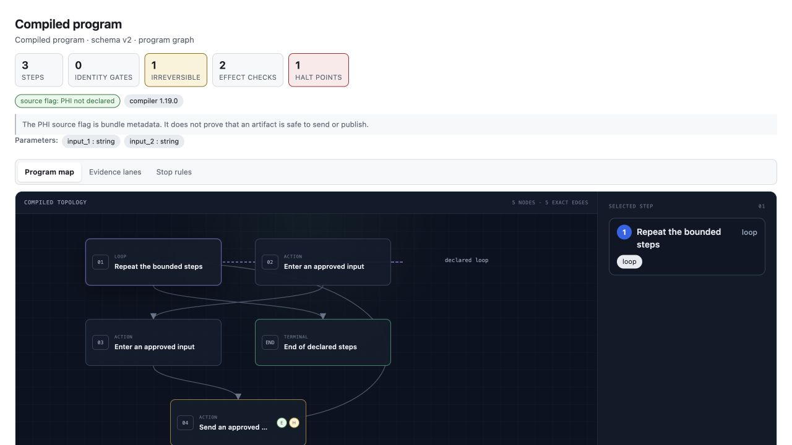
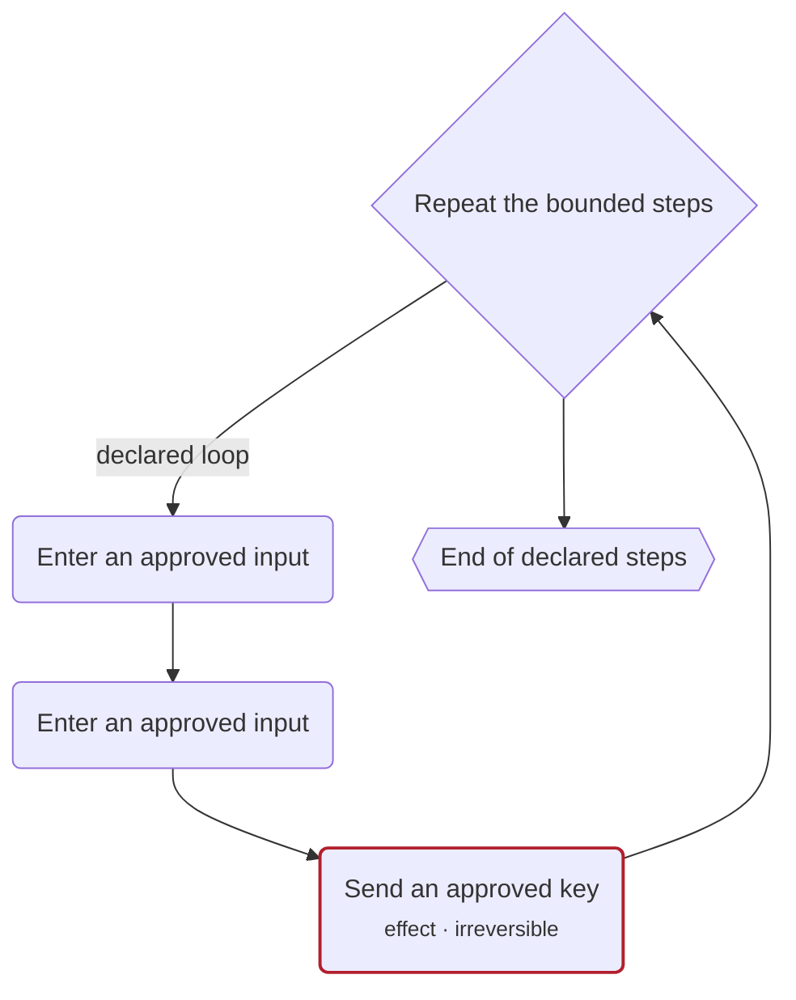

# Compiled-program visualizer

See what a demonstration compiled into. A compiled bundle is a governed
program. Each step states how the runtime resolves its target, whether an
identity gate applies, what screen and effect checks apply, and where the run
must halt.



The HTML view has three linked views:

- **Program map** renders the exact emitted edge targets. It keeps loop-back,
  branch, exception, and sequence edges distinct.
- **Evidence lanes** compares the declared resolution, identity, actuation,
  screen, effect, and stop contracts for each step.
- **Stop rules** isolates the steps that can refuse an action.

The view does not show a live verdict without an exact run trace. A declared
check is a compile-time requirement. It is not evidence that the check passed.

## One spec, three surfaces

The engine is the single source of truth. `openadapt_flow.visualize`
**emits a serializable _program-graph spec_** from a compiled bundle; every
surface renders that spec and none of them re-parse the bundle IR:

- **CLI** (`openadapt-flow visualize`) writes self-contained HTML, Mermaid, or JSON.
- **Cloud** (`app.openadapt.ai`) uses an interactive React view over the same spec.
- **Desktop** uses a local React view over the qualification graph projection.

The spec is versioned and has a committed JSON Schema
(`schemas/program-graph-v1.json`) so non-Python surfaces validate the same
shape. A sample emitted spec lives at
[`docs/showcase-openemr/program-graph.json`](showcase-openemr/program-graph.json).

### Spec shape (v1)

```
ProgramGraphSpec
├─ spec_version
├─ bundle: BundleMeta      # name, schema version, PHI/encryption flags,
│                          # provenance/certification, params, rollup counts
├─ nodes: [GraphNode]      # one per compiled step / program state
│   ├─ kind                # action | branch | business_decision | loop |
│   │                      # subflow_call | terminal
│   ├─ title, action, risk # intent, click/type/…, reversible|irreversible
│   ├─ resolution          # the target-resolution LADDER + which rung is top
│   ├─ identity            # armed? phi-free? unarmed-reason?
│   ├─ effects             # system-of-record checks
│   ├─ postconditions      # vision verification kinds
│   ├─ guard / wait_until  # control-flow preconditions
│   ├─ halts               # fail-safe HALT points this node introduces
│   └─ badges
└─ edges: [GraphEdge]      # sequence | branch | exception | loop_body
```

Nodes = steps. Edges = sequence, with typed room for branches / loops /
exception paths. Annotations = verification points and halt points. A linear
bundle (today's common case) projects to a straight chain of `action` nodes
ending in a `success` terminal; a Phase-2 program graph projects its full state
machine 1:1, so richer compiled structure renders without a spec break.

## CLI

```bash
# self-contained HTML (opens offline; no network, CSP-safe)
openadapt-flow visualize path/to/bundle -o program.html

# Mermaid flowchart source for Markdown / docs / a PR description
openadapt-flow visualize path/to/bundle --format mermaid

# the shared JSON graph spec (what Cloud and Desktop render)
openadapt-flow visualize path/to/bundle --format json -o program-graph.json

# a closed projection for a remote viewer or approved derivative
openadapt-flow visualize path/to/bundle --profile remote-safe -o program.html
```

The default `operator-local` profile includes local diagnostic detail.
`remote-safe`, `public-synthetic`, and `sanitized-derivative` remove recorded
text, parameter values, selectors, URLs, free-text predicates, and local
provenance. The projection does not sanitize the source bundle. It does not
prove that the source is safe to send.

## Rendering choice and tradeoffs

- **The engine emits the spec and each surface renders it.** Each surface avoids
  re-parsing the bundle IR. This keeps one projection of the compiled semantics
  and a single wire contract. Cloud and Desktop do not need to invent the graph
  from display order.
- **A small deterministic layout handles the offline view.** It follows the
  actual edge targets and draws back edges explicitly. It keeps the file
  self-contained and avoids a runtime dependency. Cloud uses a React renderer
  over the same graph contract. Mermaid remains a portable export format.
- **Self-contained HTML.** The CLI inlines the shared CSS + a dependency-free
  vanilla-JS renderer (`openadapt_flow/visualize/static/program_graph.{css,js}`)
  and embeds the spec as JSON, so the page opens offline and renders under a
  strict CSP.

## What `visualize` shows

This Mermaid output comes from the bounded loop fixture. The command uses the
public-safe projection, so it keeps the structure and removes recorded values.


```mermaid
flowchart TD
  n0{"Repeat the bounded steps"}
  n1("Enter an approved input")
  n2("Enter an approved input")
  n3("Send an approved key<br/><small>effect · irreversible</small>")
  n4{{"End of declared steps"}}
  n0 -->|declared loop| n1
  n1 --> n2
  n2 --> n3
  n3 --> n0
  n0 --> n4
  classDef irreversible stroke:#b4530a,stroke-width:2px;
  classDef halt stroke:#b21f2d,stroke-width:2px;
  class n3 irreversible;
  class n3 halt;
```

How to read this map:

- `n0` owns the bounded loop. The `declared loop` edge enters its body.
- The edge from `n3` to `n0` returns for the next item. The edge from `n0` to
  `n4` exits when the worklist is complete.
- `End of declared steps` is a program terminal. It does not claim that a live
  run achieved `VERIFIED`.
- The HTML view adds the resolution, identity, screen, effect, and stop
  controls for each selected node.
