# ✅ openemr-add-patient-note — success

- **Started:** 2026-07-08T17:34:45.999882+00:00
- **Steps:** 18/18 ok
- **Heals:** 1
- **Data egress:** none — fully local replay (zero screenshots left the box)

## Parameters

| Param | Value |
| --- | --- |
| `note` | Replay run 1: medication adherence confirmed, refill authorized. |

## Identity protection coverage

_No identity-applicable (anchored click/type) steps in this workflow._

## Effect verification (system of record)

_No executed step carried a system-of-record effect contract — every write on this run was verified from screen evidence only. Run `openadapt-flow lint` to see the bundle's consequential-step effect coverage._

## Steps

| # | Step | Intent | Rung | Confidence | Verified | ms | Healed | OK |
| --- | --- | --- | --- | --- | --- | --- | --- | --- |
| 1 | `step_000` | click 'ername' | template | 1.00 | &mdash; | 584 |  | ✅ |
| 2 | `step_001` | type 'admin' | &mdash; | &mdash; | &mdash; | 861 |  | ✅ |
| 3 | `step_002` | click 'Password' | template | 1.00 | &mdash; | 380 |  | ✅ |
| 4 | `step_003` | type 'pass' | &mdash; | &mdash; | &mdash; | 388 |  | ✅ |
| 5 | `step_004` | click 'Login' | template | 1.00 | &mdash; | 2297 |  | ✅ |
| 6 | `step_005` | click 'Searchbyanydemogre' | template | 1.00 | &mdash; | 4201 |  | ✅ |
| 7 | `step_006` | type 'Phil' | &mdash; | &mdash; | &mdash; | 1283 |  | ✅ |
| 8 | `step_007` | press Enter | &mdash; | &mdash; | &mdash; | 2160 |  | ✅ |
| 9 | `step_008` | click 'ford,Phil' | template | 1.00 | &mdash; | 2333 |  | ✅ |
| 10 | `step_009` | scroll by (0, 400) | &mdash; | &mdash; | &mdash; | 6085 |  | ✅ |
| 11 | `step_010` | scroll by (0, 400) | &mdash; | &mdash; | &mdash; | 4342 |  | ✅ |
| 12 | `step_011` | scroll by (0, 400) | &mdash; | &mdash; | &mdash; | 2133 |  | ✅ |
| 13 | `step_012` | scroll by (0, 400) | &mdash; | &mdash; | &mdash; | 2197 |  | ✅ |
| 14 | `step_013` | click at (815, 369) | geometry | 0.90 | &mdash; | 3554 | 🩹 | ✅ |
| 15 | `step_014` | click '+Add <B' | template | 1.00 | &mdash; | 2120 |  | ✅ |
| 16 | `step_015` | click at (639, 357) | template | 1.00 | &mdash; | 444 |  | ✅ |
| 17 | `step_016` | type <note> | &mdash; | &mdash; | &mdash; | 415 |  | ✅ |
| 18 | `step_017` | click 'Save as new messag' | template | 1.00 | &mdash; | 1972 |  | ✅ |

## Per-step evidence

Every step below shows the frame **before** and **after** the action next to the resolution rung, the identity-gate and effect-check verdicts, and whether the step healed or halted. The generator links only retained run artifacts and never synthesizes pixels. If image redaction was enabled when a frame was persisted, that redaction is already burned into its pixels; a frame the run did not retain is marked _not retained_.

### 1. `step_000` — click 'ername'

**Rung** `template` (conf 1.00, resolved (705, 404)) · **Gates** none on this step · **Heal** none · **Outcome** ✅ ok

| Before | After |
| --- | --- |
|  |  |

### 2. `step_001` — type 'admin'

**Rung** &mdash; (keyboard / wait step, no anchor) · **Gates** none on this step · **Heal** none · **Outcome** ✅ ok

| Before | After |
| --- | --- |
|  |  |

### 3. `step_002` — click 'Password'

**Rung** `template` (conf 1.00, resolved (684, 458)) · **Gates** none on this step · **Heal** none · **Outcome** ✅ ok

| Before | After |
| --- | --- |
|  |  |

### 4. `step_003` — type 'pass'

**Rung** &mdash; (keyboard / wait step, no anchor) · **Gates** none on this step · **Heal** none · **Outcome** ✅ ok

| Before | After |
| --- | --- |
|  |  |

### 5. `step_004` — click 'Login'

**Rung** `template` (conf 1.00, resolved (639, 566)) · **Gates** none on this step · **Heal** none · **Outcome** ✅ ok

| Before | After |
| --- | --- |
|  |  |

### 6. `step_005` — click 'Searchbyanydemogre'

**Rung** `template` (conf 1.00, resolved (1121, 31)) · **Gates** none on this step · **Heal** none · **Outcome** ✅ ok

| Before | After |
| --- | --- |
| 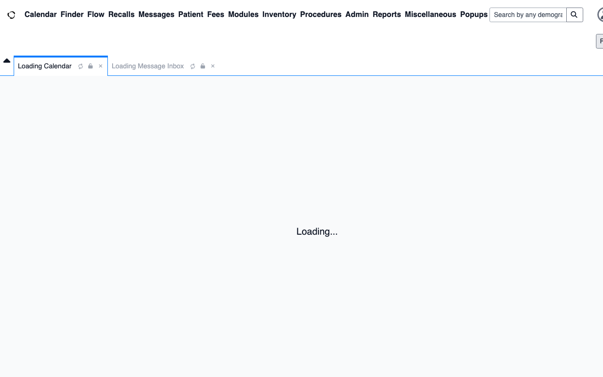 |  |

### 7. `step_006` — type 'Phil'

**Rung** &mdash; (keyboard / wait step, no anchor) · **Gates** none on this step · **Heal** none · **Outcome** ✅ ok

| Before | After |
| --- | --- |
| 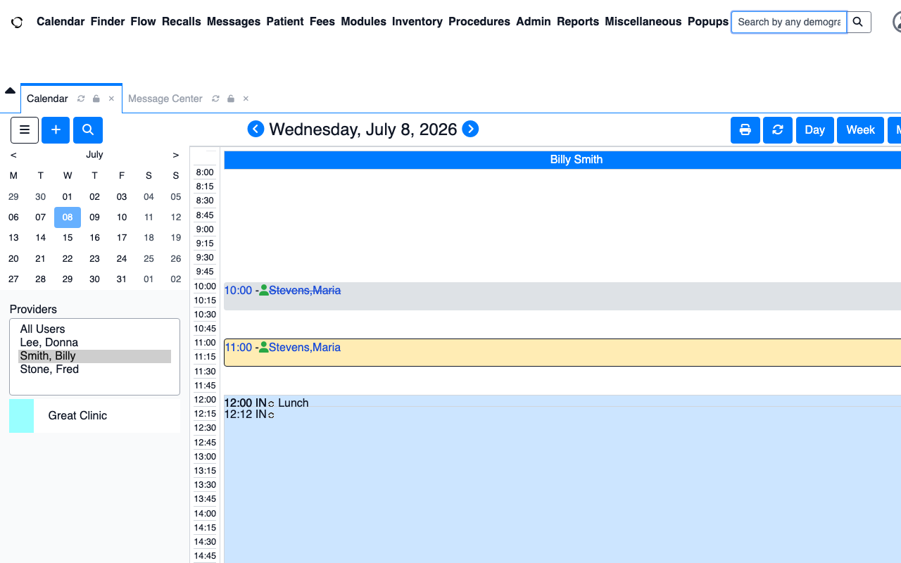 |  |

### 8. `step_007` — press Enter

**Rung** &mdash; (keyboard / wait step, no anchor) · **Gates** none on this step · **Heal** none · **Outcome** ✅ ok

| Before | After |
| --- | --- |
|  |  |

### 9. `step_008` — click 'ford,Phil'

**Rung** `template` (conf 1.00, resolved (17, 457)) · **Gates** none on this step · **Heal** none · **Outcome** ✅ ok

| Before | After |
| --- | --- |
| 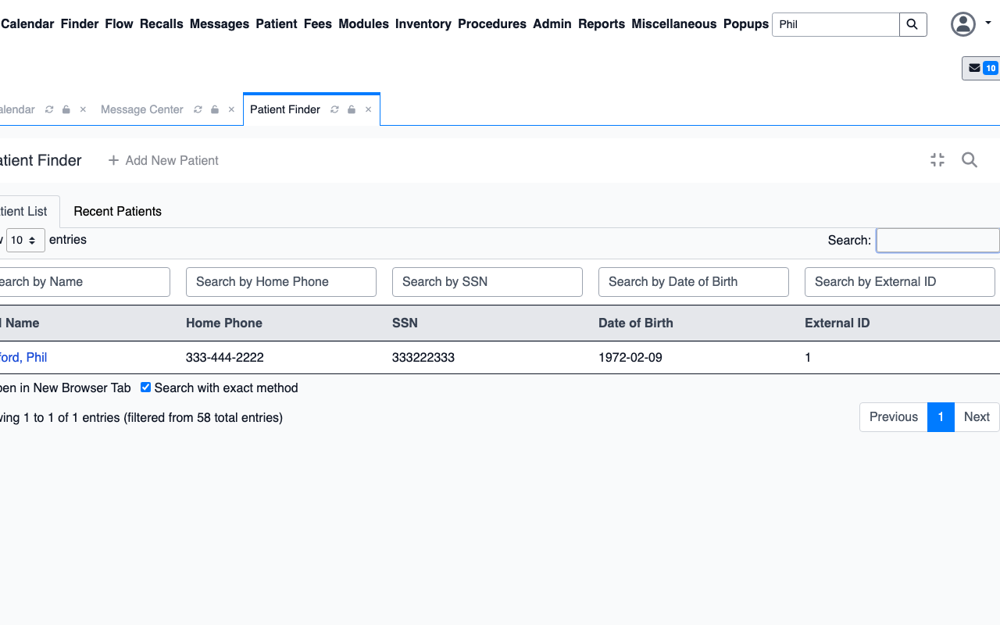 | 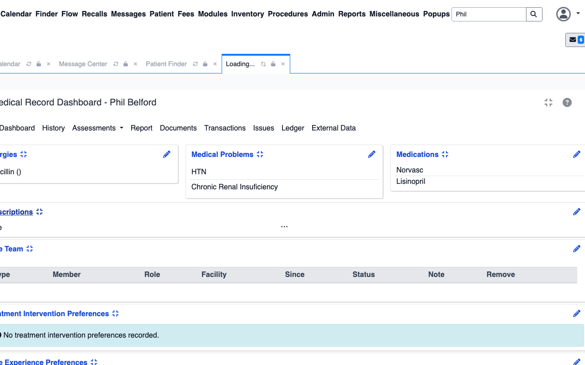 |

### 10. `step_009` — scroll by (0, 400)

**Rung** &mdash; (keyboard / wait step, no anchor) · **Gates** none on this step · **Heal** none · **Outcome** ✅ ok

| Before | After |
| --- | --- |
| 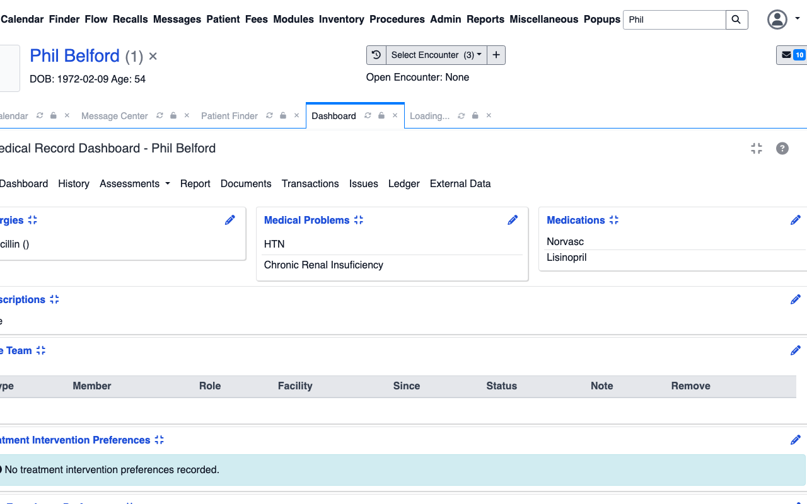 |  |

### 11. `step_010` — scroll by (0, 400)

**Rung** &mdash; (keyboard / wait step, no anchor) · **Gates** none on this step · **Heal** none · **Outcome** ✅ ok

| Before | After |
| --- | --- |
| 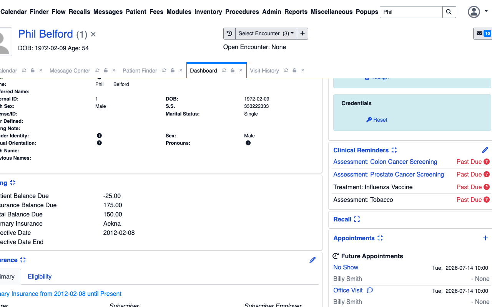 | 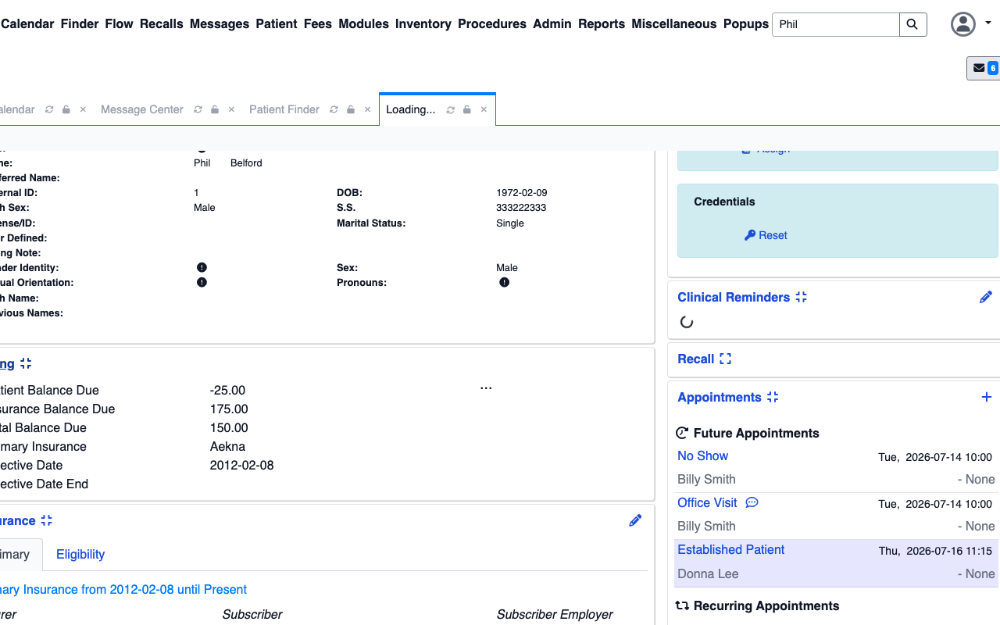 |

### 12. `step_011` — scroll by (0, 400)

**Rung** &mdash; (keyboard / wait step, no anchor) · **Gates** none on this step · **Heal** none · **Outcome** ✅ ok

| Before | After |
| --- | --- |
|  |  |

### 13. `step_012` — scroll by (0, 400)

**Rung** &mdash; (keyboard / wait step, no anchor) · **Gates** none on this step · **Heal** none · **Outcome** ✅ ok

| Before | After |
| --- | --- |
|  |  |

### 14. `step_013` — click at (815, 369) (healed)

**Rung** `geometry` (conf 0.90, resolved (814, 768)) · **Gates** none on this step · **Heal** healed via `geometry` · **Outcome** ✅ ok

| Before | After |
| --- | --- |
|  |  |

**Heal detail** (`anchor_refresh` via `geometry`, applied):

- anchor `templates/step_013.png` → `templates/step_013.png`

| Healed frame |
| --- |
| 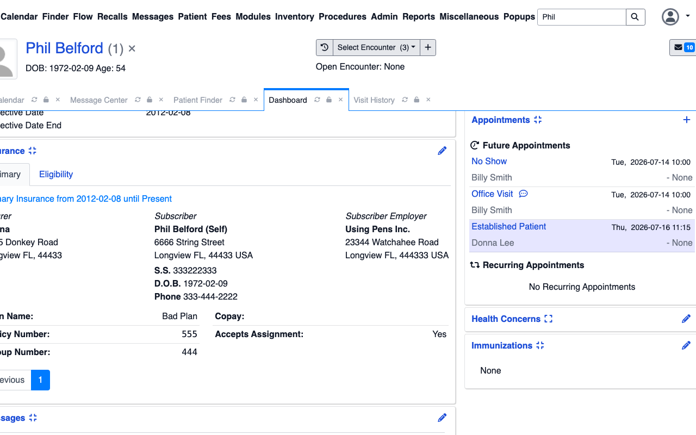 |

### 15. `step_014` — click '+Add <B'

**Rung** `template` (conf 1.00, resolved (90, 281)) · **Gates** none on this step · **Heal** none · **Outcome** ✅ ok

| Before | After |
| --- | --- |
|  |  |

### 16. `step_015` — click at (639, 357)

**Rung** `template` (conf 1.00, resolved (639, 357)) · **Gates** none on this step · **Heal** none · **Outcome** ✅ ok

| Before | After |
| --- | --- |
|  | 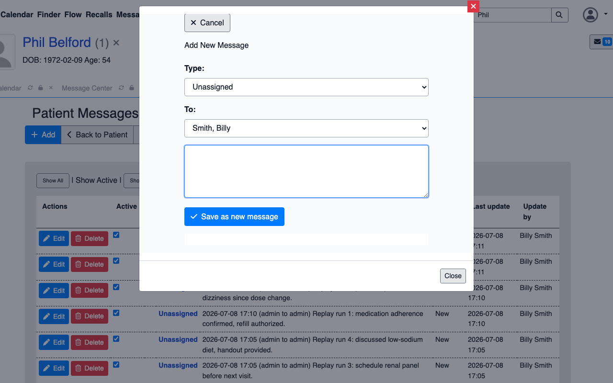 |

### 17. `step_016` — type <note>

**Rung** &mdash; (keyboard / wait step, no anchor) · **Gates** none on this step · **Heal** none · **Outcome** ✅ ok

| Before | After |
| --- | --- |
|  | 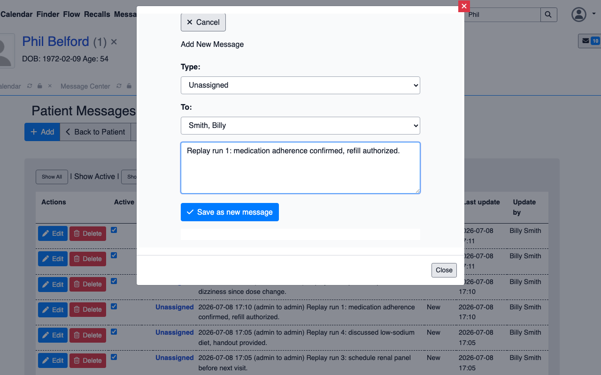 |

### 18. `step_017` — click 'Save as new messag' (final step)

**Rung** `template` (conf 1.00, resolved (489, 452)) · **Gates** none on this step · **Heal** none · **Outcome** ✅ ok

| Before | After |
| --- | --- |
|  | 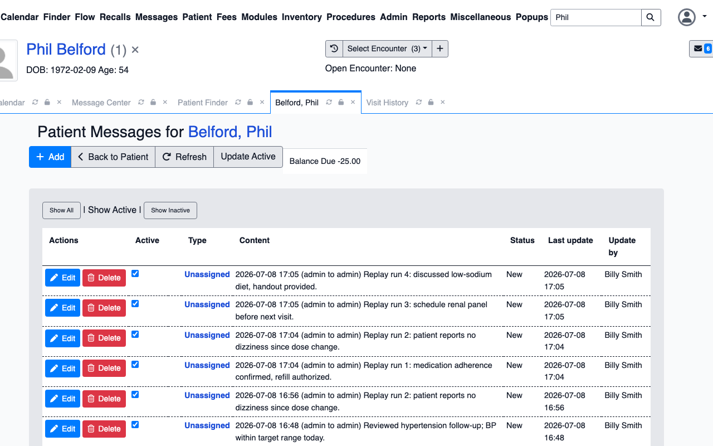 |

## Rung histogram

| Rung | Count | |
| --- | --- | --- |
| `template` | 8 | ████████ |
| `template_global` | 0 |  |
| `ocr` | 0 |  |
| `geometry` | 1 | █ |
| `grounder` | 0 |  |

## Totals

| Metric | Value |
| --- | --- |
| Total time | 37748 ms |
| Steps ok | 18/18 |
| Heals | 1 |
| model_calls | 0 |
| est_model_cost_usd | $0.0000 |
