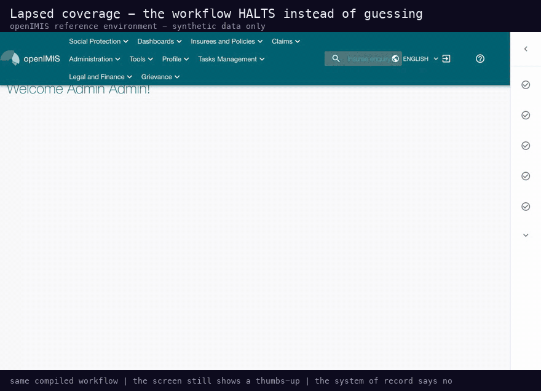
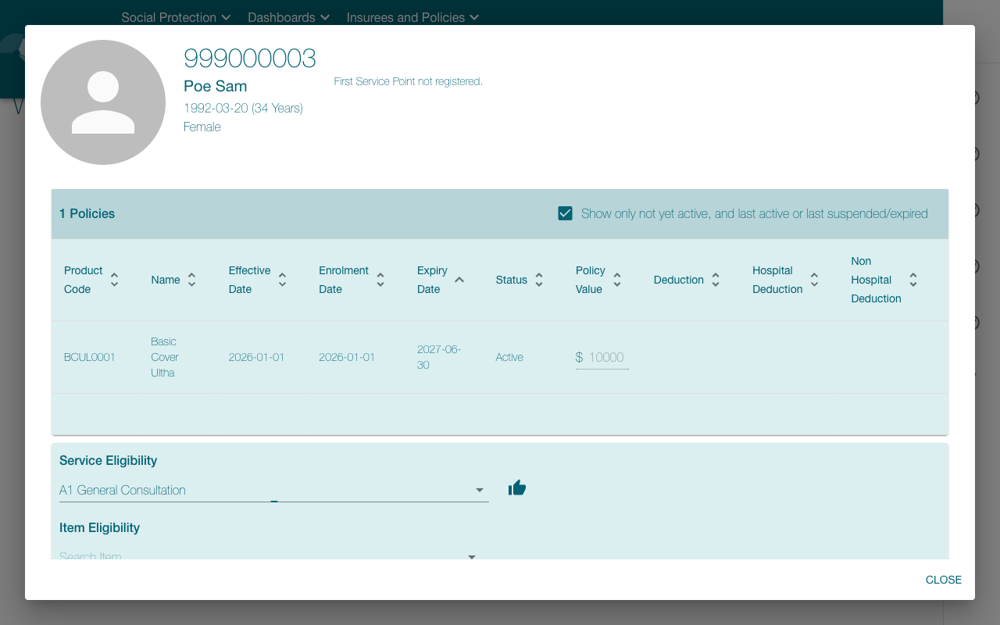
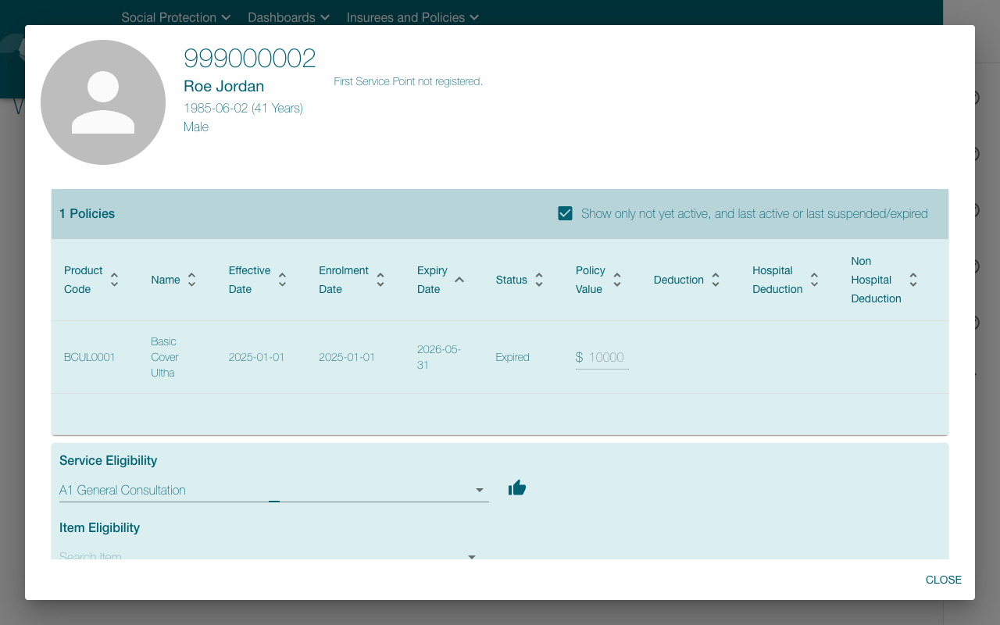

# openIMIS eligibility check — effect-verified showcase

Can an insurance **coverage / eligibility check** be demonstrated once,
compiled, replayed deterministically for other policyholders, and — the part
screen-scraping automation cannot do — **certified against the insurer's own
database** instead of the screen? This showcase runs the full loop on the
pinned openIMIS reference environment
([`benchmark/openimis_claims/`](../../benchmark/openimis_claims/README.md)),
driven by
[`scripts/openimis_eligibility_demo.py`](../../scripts/openimis_eligibility_demo.py).

**Everything here is synthetic**: the upstream openIMIS demo dataset plus
three bootstrap-created policyholders (insuree numbers `999000001`/`999000003`
in force, `999000002` lapsed 2026-05-31). This is a contract-proven fixture
demo — not a benchmark, not a customer deployment, and not a claim about any
commercial payer portal.

## The workflow (6 compiled steps)

Login is unmeasured setup. The recorded demonstration, on the openIMIS home
screen:

1. click the app-bar **Insuree enquiry** field (`step_000`)
2. type the insuree number — **parameterized** as `insurance_no` (`step_001`)
3. press Enter → the enquiry dialog resolves the policyholder, their policy
   row and its status (`step_002`)
4. click **Search Service** in the dialog's Service Eligibility panel
   (`step_003`)
5. type `General` (`step_004`)
6. click **A1 General Consultation** → the service-eligibility indicator
   renders (`step_005`)

The compiler binds two system-of-record effect contracts to the final step
(effect-verifier kit, [`docs/EFFECT_KIT.md`](../EFFECT_KIT.md)), each keyed to
the RUN's `insurance_no`:

- `record_written` — exactly one in-force policy row exists for the checked
  policyholder;
- `field_equals` — that policy's derived `coverage` field equals `Active`.

[`deployment.eligibility.yaml`](../../benchmark/openimis_claims/deployment.eligibility.yaml)
wires them to ONE read-only SELECT over openIMIS's PostgreSQL policy tables,
executed as a dedicated read-only role (`SELECT` on three tables,
`default_transaction_read_only=on`).

## Green run — [`green-run/REPORT.md`](green-run/REPORT.md)


Replayed for **`999000003` (Sam Poe) — a policyholder the demonstration never
saw** (the demo was recorded on `999000001`). 6/6 steps, all three clicks
identity-armed and template-resolved at confidence 1.00, typed input
read back and verified, **zero model calls**, ~13 s wall. Both contracts
CONFIRMED:

```
[sql] record_written: CONFIRMED — exactly 1 record(s) match the target selector
[sql] field_equals:   CONFIRMED — field 'coverage' equals the expected value
```

## Halt run — [`halt-run/REPORT.md`](halt-run/REPORT.md)



Replayed for **`999000002` (Jordan Roe), whose policy expired 2026-05-31**.
The GUI lookup completes — and the enquiry dialog **still renders a
service-eligibility thumbs-up** next to the selected service even though the
policy row reads "Expired": exactly the screen a hurried human or a
screen-scraping bot can misread as "covered". The workflow does not guess:

```
[sql] record_written: CONFIRMED — exactly 1 record(s) match the target selector
[sql] field_equals:   REFUTED — field 'coverage' is 'Inactive', expected 'Active'
System-of-record effect verification HALTED step 'step_005' … — run aborted
```

The run report records the refusal with evidence (contract hashes, verdicts,
before/after screenshots). Halt + evidence, never a silently wrong
eligibility answer.

## Stills

| | |
| --- | --- |
|  |  |
| Active coverage (green run, final frame) | Lapsed coverage — note the thumbs-up the DB refutes |

## Honest scope

- The macro loop (record → compile → certify → replay → SQL-verified verdict)
  ran end to end on this machine against the pinned fixture; the gifs are
  unedited footage of those runs plus a closing card quoting the reports.
- Certified under the `permissive` policy; `clinical-write` accurately flags
  the two unlabeled dialog clicks (compile-time confidence 0.70) and the
  typing step's vacuous postcondition — findings that matter for unattended
  writes, acceptable for this demonstrated read-only check.
- A real dental-office deployment would target the payer portal /
  clearinghouse the office actually uses, with its own read-only oracle; this
  environment stands in for those systems with a real open-source insurance
  platform.
