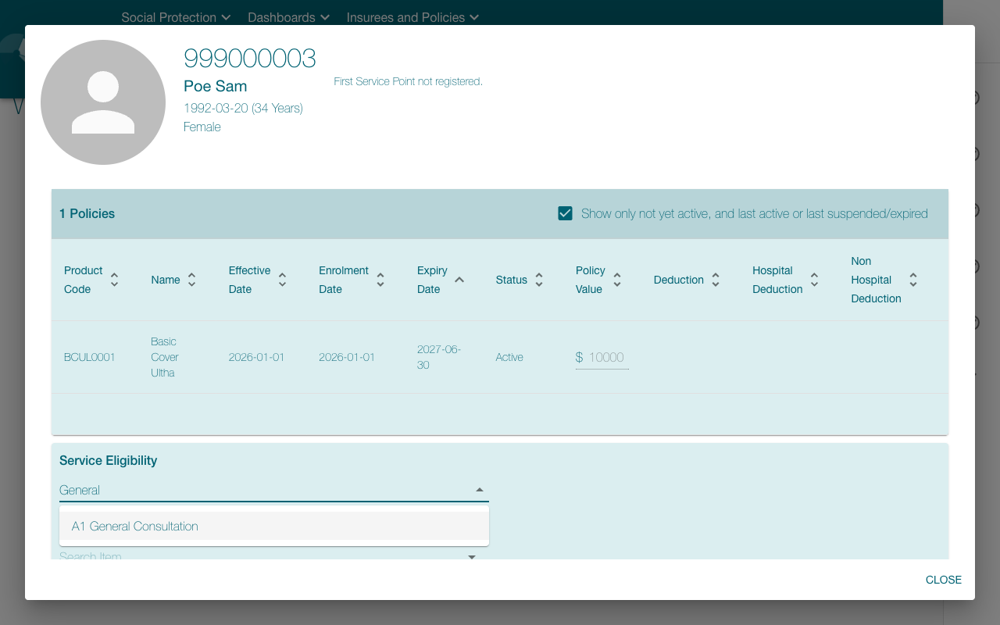

# ✅ openimis-eligibility-check — success

- **Started:** 2026-07-18T17:21:24.186775+00:00
- **Steps:** 6/6 ok
- **Heals:** 0
- **Data egress:** none — fully local replay (zero screenshots left the box)

## Parameters

| Param | Value |
| --- | --- |
| `insurance_no` | 999000003 |

## Identity protection coverage

**3 of 3 click steps identity-armed.** Unarmed clicks proceed with **no identity verification** (see docs/LIMITS.md).

## Effect verification (system of record)

**1 of 6 executed step(s) carried a system-of-record effect contract** — 1 confirmed, 0 halted, 0 approved-unverified. Steps without a contract fall back to screen evidence for their writes (run `openadapt-flow lint` for the bundle's per-consequential-step effect coverage).

## Steps

| # | Step | Intent | Rung | Confidence | Verified | ms | Healed | OK |
| --- | --- | --- | --- | --- | --- | --- | --- | --- |
| 1 | `step_000` | click 'Q Insuree enquiry ?' | template | 1.00 | id ✓ | 1932 |  | ✅ |
| 2 | `step_001` | type <insurance_no> | &mdash; | &mdash; | input ✓ | 843 |  | ✅ |
| 3 | `step_002` | press Enter | &mdash; | &mdash; | &mdash; | 1921 |  | ✅ |
| 4 | `step_003` | click at (323, 626) | template | 1.00 | id ✓ | 2007 |  | ✅ |
| 5 | `step_004` | type 'General' | &mdash; | &mdash; | input ✓ | 2110 |  | ✅ |
| 6 | `step_005` | click at (351, 673) | template | 1.00 | id ✓, effect ✓ | 1717 |  | ✅ |

## Screenshots

### `step_005` — click at (351, 673) (final step)

| Before | After |
| --- | --- |
|  |  |

## Rung histogram

| Rung | Count | |
| --- | --- | --- |
| `template` | 3 | ███ |
| `template_global` | 0 |  |
| `ocr` | 0 |  |
| `geometry` | 0 |  |
| `grounder` | 0 |  |

## Totals

| Metric | Value |
| --- | --- |
| Total time | 10530 ms |
| Steps ok | 6/6 |
| Heals | 0 |
| model_calls | 0 |
| est_model_cost_usd | $0.0000 |
