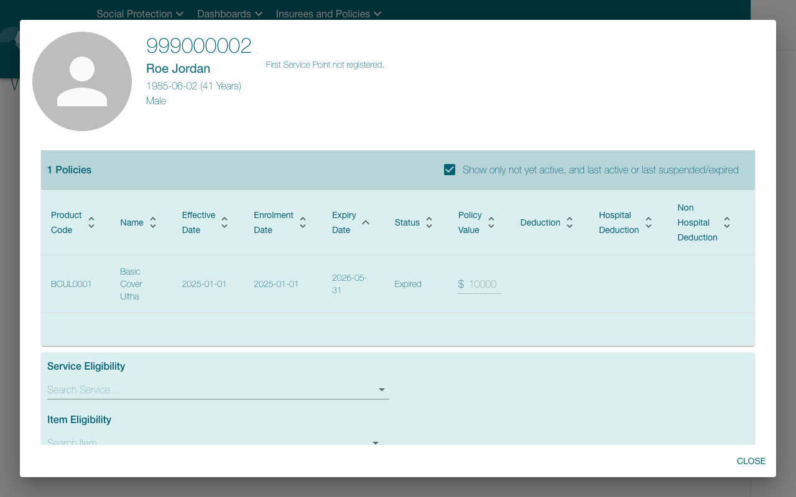
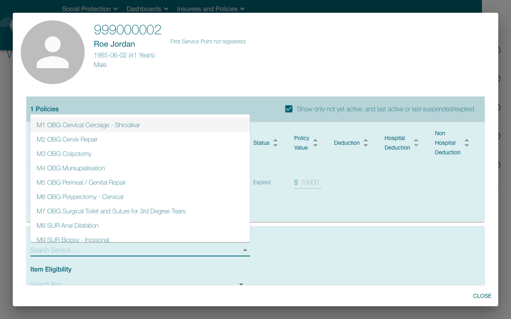
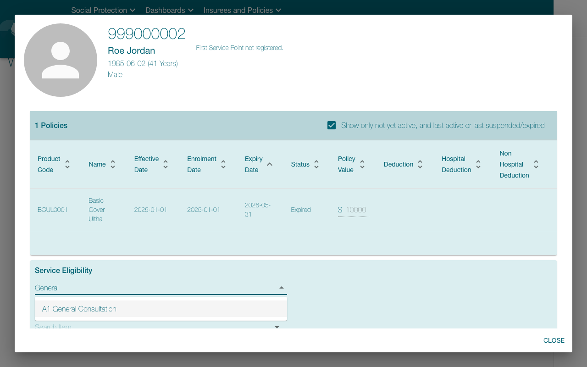

# ❌ openimis-eligibility-check — FAILED

- **Started:** 2026-07-21T10:12:06.295744+00:00
- **Steps:** 5/6 ok
- **Heals:** 0
- **Data egress:** none — fully local replay (zero screenshots left the box)

## Parameters

| Param | Value |
| --- | --- |
| `insurance_no` | 999000002 |
| `service_code` | A1 |
| `as_of_date` | 2026-07-21 |

## Identity protection coverage

**3 of 3 click steps identity-armed.** Unarmed clicks proceed with **no identity verification** (see docs/LIMITS.md).

## Effect verification (system of record)

**1 of 6 executed step(s) carried a system-of-record effect contract** — 0 confirmed, 1 halted, 0 approved-unverified. Steps without a contract have only screen evidence for their local step outcome (run `openadapt-flow lint` for the bundle's per-consequential-step effect coverage).

## Steps

| # | Step | Intent | Rung | Confidence | Verified | ms | Healed | OK |
| --- | --- | --- | --- | --- | --- | --- | --- | --- |
| 1 | `step_000` | click 'Q Insuree enquiry ?' | structural | 1.00 | id ✓ | 1174 |  | ✅ |
| 2 | `step_001` | type <insurance_no> | &mdash; | &mdash; | input ✓ | 783 |  | ✅ |
| 3 | `step_002` | press Enter | &mdash; | &mdash; | &mdash; | 1242 |  | ✅ |
| 4 | `step_003` | click at (323, 626) | structural | 1.00 | id ✓ | 1123 |  | ✅ |
| 5 | `step_004` | type 'General' | &mdash; | &mdash; | input ✓ | 1458 |  | ✅ |
| 6 | `step_005` | click at (351, 673) | structural | 1.00 | id ✓, effect ✗ | 6254 |  | ❌ |

## Per-step evidence

Every step below shows the frame **before** and **after** the action next to the resolution rung, the identity-gate and effect-check verdicts, and whether the step healed or halted. The generator links only retained run artifacts and never synthesizes pixels. If image redaction was enabled when a frame was persisted, that redaction is already burned into its pixels; a frame the run did not retain is marked _not retained_.

### 1. `step_000` — click 'Q Insuree enquiry ?'

**Rung** `structural` (conf 1.00, resolved (859, 63)) · **Gates** id ✓ · **Heal** none · **Outcome** ✅ ok

| Before | After |
| --- | --- |
|  |  |

### 2. `step_001` — type <insurance_no>

**Rung** &mdash; (keyboard / wait step, no anchor) · **Gates** input ✓ · **Heal** none · **Outcome** ✅ ok

| Before | After |
| --- | --- |
|  |  |

### 3. `step_002` — press Enter

**Rung** &mdash; (keyboard / wait step, no anchor) · **Gates** none on this step · **Heal** none · **Outcome** ✅ ok

| Before | After |
| --- | --- |
|  |  |

### 4. `step_003` — click at (323, 626)

**Rung** `structural` (conf 1.00, resolved (323, 627)) · **Gates** id ✓ · **Heal** none · **Outcome** ✅ ok

| Before | After |
| --- | --- |
|  |  |

### 5. `step_004` — type 'General'

**Rung** &mdash; (keyboard / wait step, no anchor) · **Gates** input ✓ · **Heal** none · **Outcome** ✅ ok

| Before | After |
| --- | --- |
|  |  |

### 6. `step_005` — click at (351, 673) (final step, halted)

> ❌ **Error:** System-of-record effect verification HALTED step 'step_005' (click at (351, 673)): field_equals refuted against the sql system of record (the screen indicated completion but the declared outcome is contradicted or unverifiable) — field 'eligibility' is 'Ineligible', expected 'Eligible' (the system of record contradicts the declared outcome) — run aborted

**Rung** `structural` (conf 1.00, resolved (351, 673)) · **Gates** id ✓, effect ✗ · **Heal** none · **Outcome** ❌ halted

| Before | After |
| --- | --- |
|  |  |

## Rung histogram

| Rung | Count | |
| --- | --- | --- |
| `template` | 0 |  |
| `template_global` | 0 |  |
| `ocr` | 0 |  |
| `geometry` | 0 |  |
| `grounder` | 0 |  |
| `structural` | 2 | ██ |

## Totals

| Metric | Value |
| --- | --- |
| Total time | 12035 ms |
| Steps ok | 5/6 |
| Heals | 0 |
| model_calls | 0 |
| est_model_cost_usd | $0.0000 |
