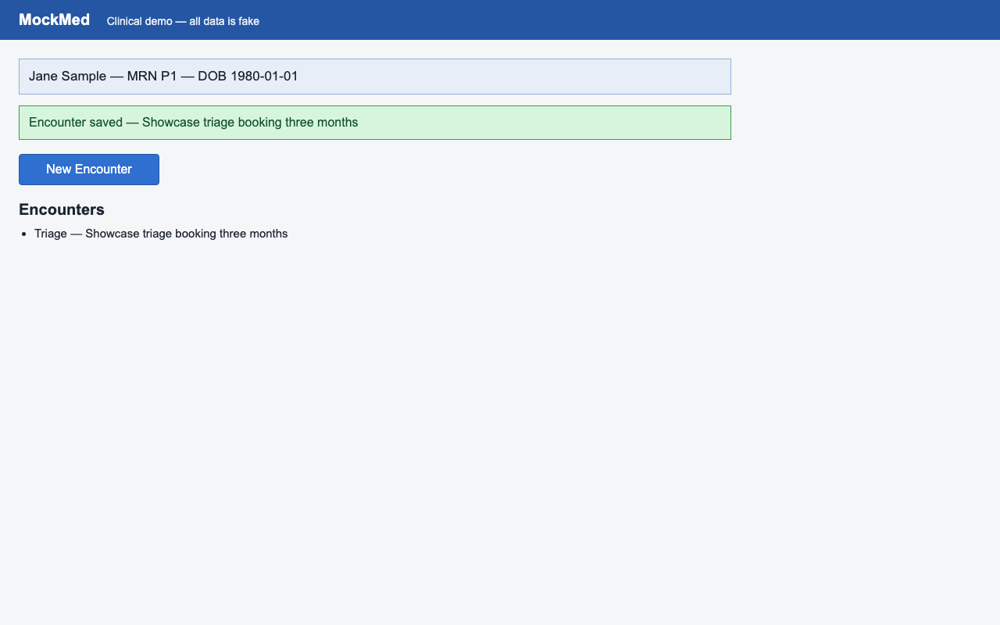

# ✅ mockmed-triage — success

- **Started:** 2026-07-06T18:29:51.632497+00:00
- **Steps:** 11/11 ok
- **Heals:** 0

## Parameters

| Param | Value |
| --- | --- |
| `note` | Showcase triage booking three months |

## Steps

| # | Step | Intent | Rung | Confidence | ms | Healed | OK |
| --- | --- | --- | --- | --- | --- | --- | --- |
| 1 | `step_000` | click at (214, 195) | template | 1.00 | 372 |  | ✅ |
| 2 | `step_001` | type 'nurse.demo' | &mdash; | &mdash; | 553 |  | ✅ |
| 3 | `step_002` | click at (214, 264) | template | 1.00 | 341 |  | ✅ |
| 4 | `step_003` | type 'mockmed-demo-pass' | &mdash; | &mdash; | 324 |  | ✅ |
| 5 | `step_004` | click 'Sign In' | template | 1.00 | 627 |  | ✅ |
| 6 | `step_005` | click 'Open' | template | 1.00 | 565 |  | ✅ |
| 7 | `step_006` | click 'New Encounter' | template | 1.00 | 546 |  | ✅ |
| 8 | `step_007` | click 'Triage' | template | 1.00 | 337 |  | ✅ |
| 9 | `step_008` | click at (344, 290) | template | 1.00 | 334 |  | ✅ |
| 10 | `step_009` | type <note> | &mdash; | &mdash; | 343 |  | ✅ |
| 11 | `step_010` | click 'Save Encounter' | template | 1.00 | 640 |  | ✅ |

## Screenshots

### `step_010` — click 'Save Encounter' (final step)

| Before | After |
| --- | --- |
|  |  |

## Rung histogram

| Rung | Count | |
| --- | --- | --- |
| `template` | 8 | ████████ |
| `template_global` | 0 |  |
| `ocr` | 0 |  |
| `geometry` | 0 |  |
| `grounder` | 0 |  |

## Totals

| Metric | Value |
| --- | --- |
| Total time | 4981 ms |
| Steps ok | 11/11 |
| Heals | 0 |
| model_calls | 0 |
| est_model_cost_usd | $0.0000 |
