# ✅ mockmed-triage — success

- **Started:** 2026-07-06T18:29:56.944727+00:00
- **Steps:** 11/11 ok
- **Heals:** 8
- **Data egress:** none — fully local replay (zero screenshots left the box)

## Parameters

| Param | Value |
| --- | --- |
| `note` | Showcase triage booking three months |

## Identity protection coverage

_No identity-applicable (anchored click/type) steps in this workflow._

## Effect verification (system of record)

_No executed step carried a system-of-record effect contract — every write on this run was verified from screen evidence only. Run `openadapt-flow lint` to see the bundle's consequential-step effect coverage._

## Steps

| # | Step | Intent | Rung | Confidence | Verified | ms | Healed | OK |
| --- | --- | --- | --- | --- | --- | --- | --- | --- |
| 1 | `step_000` | click at (214, 195) | geometry | 0.90 | &mdash; | 1037 | 🩹 | ✅ |
| 2 | `step_001` | type 'nurse.demo' | &mdash; | &mdash; | &mdash; | 582 |  | ✅ |
| 3 | `step_002` | click at (214, 264) | geometry | 0.90 | &mdash; | 943 | 🩹 | ✅ |
| 4 | `step_003` | type 'mockmed-demo-pass' | &mdash; | &mdash; | &mdash; | 339 |  | ✅ |
| 5 | `step_004` | click 'Sign In' | ocr | 1.00 | &mdash; | 1123 | 🩹 | ✅ |
| 6 | `step_005` | click 'Open' | ocr | 1.00 | &mdash; | 1192 | 🩹 | ✅ |
| 7 | `step_006` | click 'New Encounter' | ocr | 0.96 | &mdash; | 1057 | 🩹 | ✅ |
| 8 | `step_007` | click 'Triage' | ocr | 1.00 | &mdash; | 859 | 🩹 | ✅ |
| 9 | `step_008` | click at (344, 290) | geometry | 0.90 | &mdash; | 972 | 🩹 | ✅ |
| 10 | `step_009` | type <note> | &mdash; | &mdash; | &mdash; | 335 |  | ✅ |
| 11 | `step_010` | click 'Save Encounter' | ocr | 1.00 | &mdash; | 1255 | 🩹 | ✅ |

## Per-step evidence

Every step below shows the frame **before** and **after** the action next to the resolution rung, the identity-gate and effect-check verdicts, and whether the step healed or halted. The generator links only retained run artifacts and never synthesizes pixels. If image redaction was enabled when a frame was persisted, that redaction is already burned into its pixels; a frame the run did not retain is marked _not retained_.

### 1. `step_000` — click at (214, 195) (healed)

**Rung** `geometry` (conf 0.90, resolved (214, 195)) · **Gates** none on this step · **Heal** healed via `geometry` · **Outcome** ✅ ok

| Before | After |
| --- | --- |
| 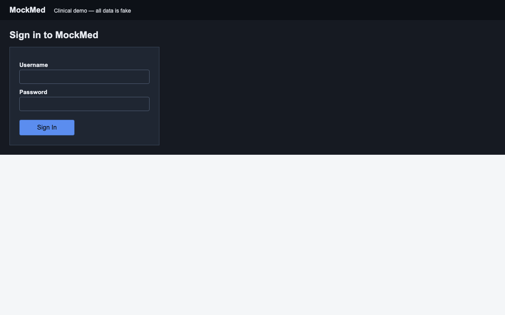 |  |

**Heal detail** (`anchor_refresh` via `geometry`, applied):

- anchor `templates/step_000.png` → `templates/step_000.png`

| Healed frame |
| --- |
|  |

### 2. `step_001` — type 'nurse.demo'

**Rung** &mdash; (keyboard / wait step, no anchor) · **Gates** none on this step · **Heal** none · **Outcome** ✅ ok

| Before | After |
| --- | --- |
| 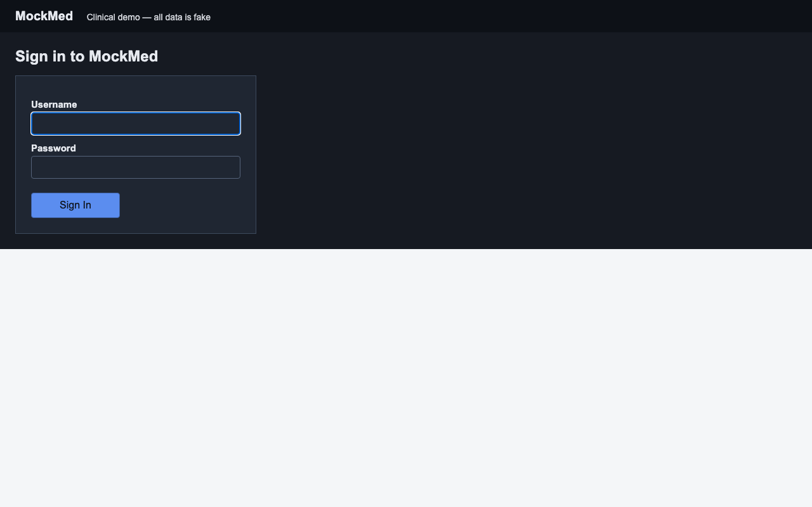 |  |

### 3. `step_002` — click at (214, 264) (healed)

**Rung** `geometry` (conf 0.90, resolved (214, 264)) · **Gates** none on this step · **Heal** healed via `geometry` · **Outcome** ✅ ok

| Before | After |
| --- | --- |
|  | 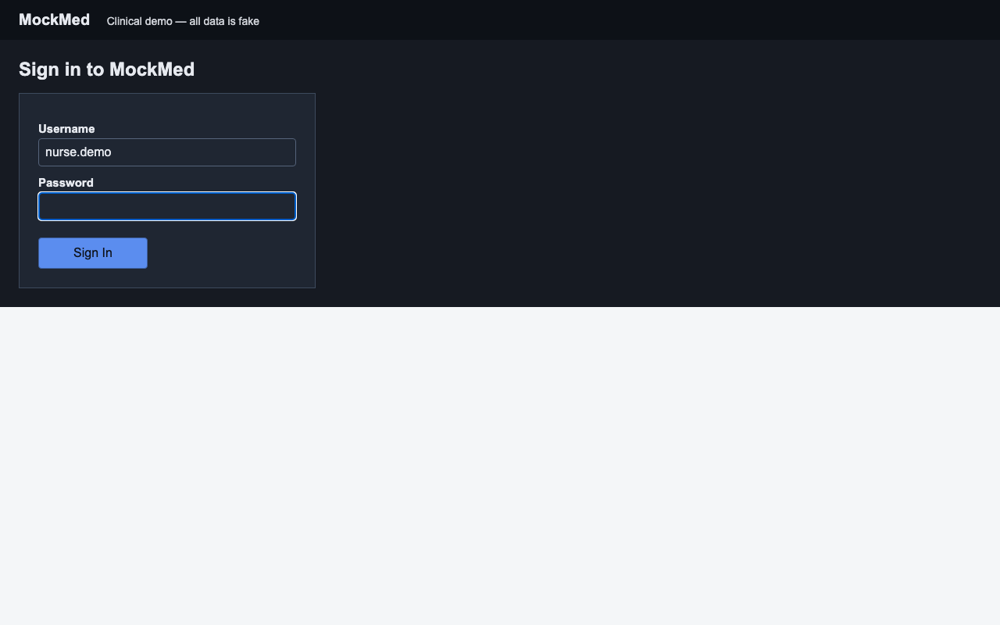 |

**Heal detail** (`anchor_refresh` via `geometry`, applied):

- anchor `templates/step_002.png` → `templates/step_002.png`

| Healed frame |
| --- |
| 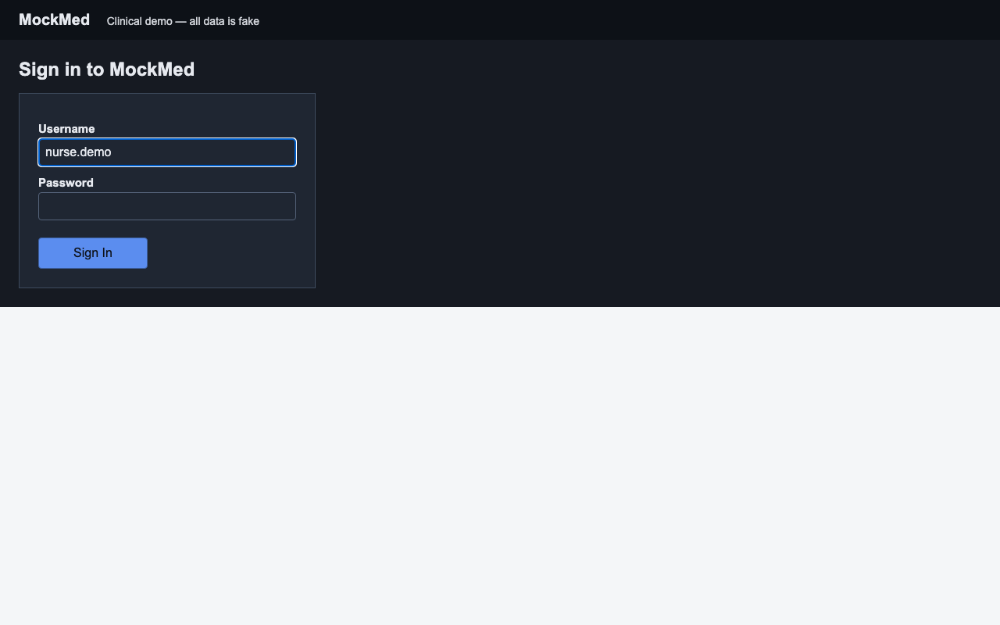 |

### 4. `step_003` — type 'mockmed-demo-pass'

**Rung** &mdash; (keyboard / wait step, no anchor) · **Gates** none on this step · **Heal** none · **Outcome** ✅ ok

| Before | After |
| --- | --- |
|  |  |

### 5. `step_004` — click 'Sign In' (healed)

**Rung** `ocr` (conf 1.00, resolved (120, 324)) · **Gates** none on this step · **Heal** healed via `ocr` · **Outcome** ✅ ok

| Before | After |
| --- | --- |
|  |  |

**Heal detail** (`anchor_refresh` via `ocr`, applied):

- anchor `templates/step_004.png` → `templates/step_004.png`

| Healed frame |
| --- |
| 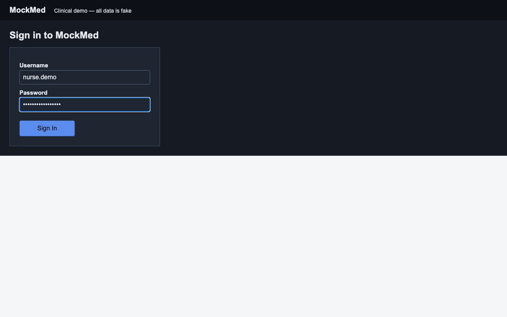 |

### 6. `step_005` — click 'Open' (healed)

**Rung** `ocr` (conf 1.00, resolved (777, 186)) · **Gates** none on this step · **Heal** healed via `ocr` · **Outcome** ✅ ok

| Before | After |
| --- | --- |
|  | 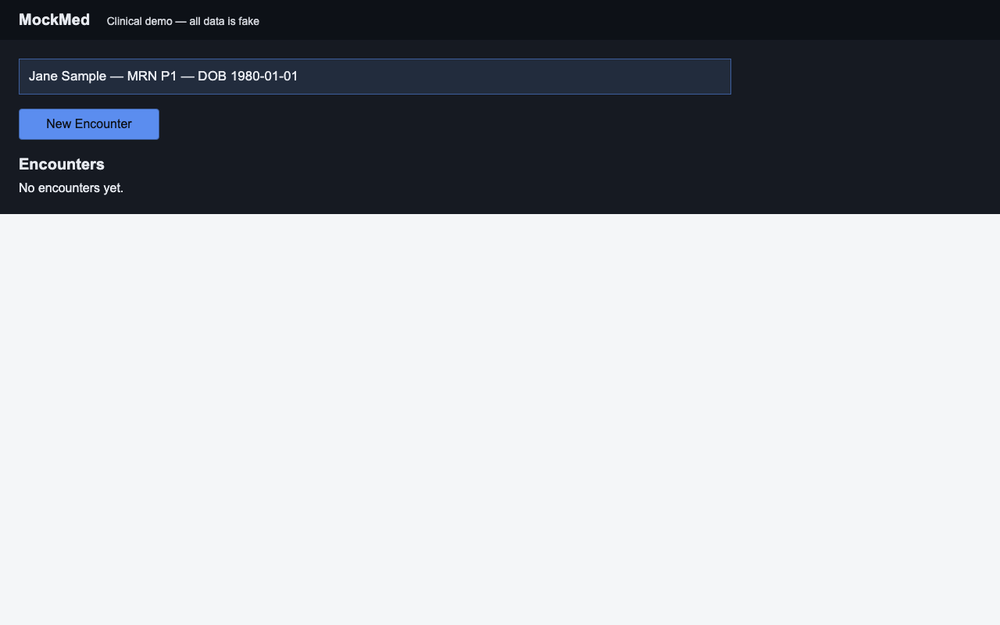 |

**Heal detail** (`anchor_refresh` via `ocr`, applied):

- anchor `templates/step_005.png` → `templates/step_005.png`

| Healed frame |
| --- |
| 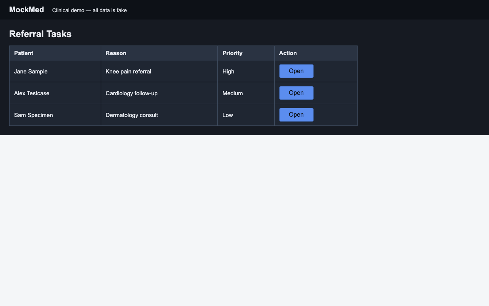 |

### 7. `step_006` — click 'New Encounter' (healed)

**Rung** `ocr` (conf 0.96, resolved (114, 159)) · **Gates** none on this step · **Heal** healed via `ocr` · **Outcome** ✅ ok

| Before | After |
| --- | --- |
|  |  |

**Heal detail** (`anchor_refresh` via `ocr`, applied):

- anchor `templates/step_006.png` → `templates/step_006.png`

| Healed frame |
| --- |
|  |

### 8. `step_007` — click 'Triage' (healed)

**Rung** `ocr` (conf 1.00, resolved (85, 160)) · **Gates** none on this step · **Heal** healed via `ocr` · **Outcome** ✅ ok

| Before | After |
| --- | --- |
|  |  |

**Heal detail** (`anchor_refresh` via `ocr`, applied):

- anchor `templates/step_007.png` → `templates/step_007.png`

| Healed frame |
| --- |
| 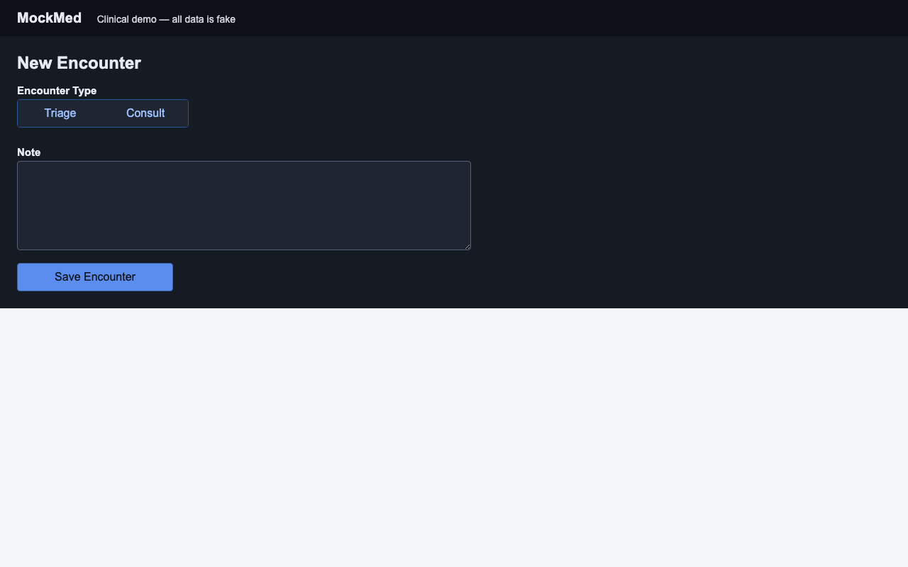 |

### 9. `step_008` — click at (344, 290) (healed)

**Rung** `geometry` (conf 0.90, resolved (344, 290)) · **Gates** none on this step · **Heal** healed via `geometry` · **Outcome** ✅ ok

| Before | After |
| --- | --- |
|  |  |

**Heal detail** (`anchor_refresh` via `geometry`, applied):

- anchor `templates/step_008.png` → `templates/step_008.png`

| Healed frame |
| --- |
| 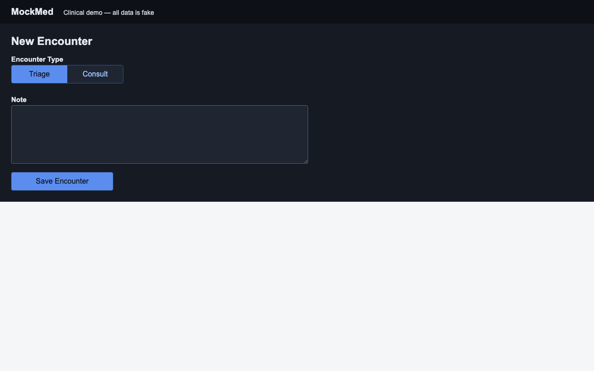 |

### 10. `step_009` — type <note>

**Rung** &mdash; (keyboard / wait step, no anchor) · **Gates** none on this step · **Heal** none · **Outcome** ✅ ok

| Before | After |
| --- | --- |
| 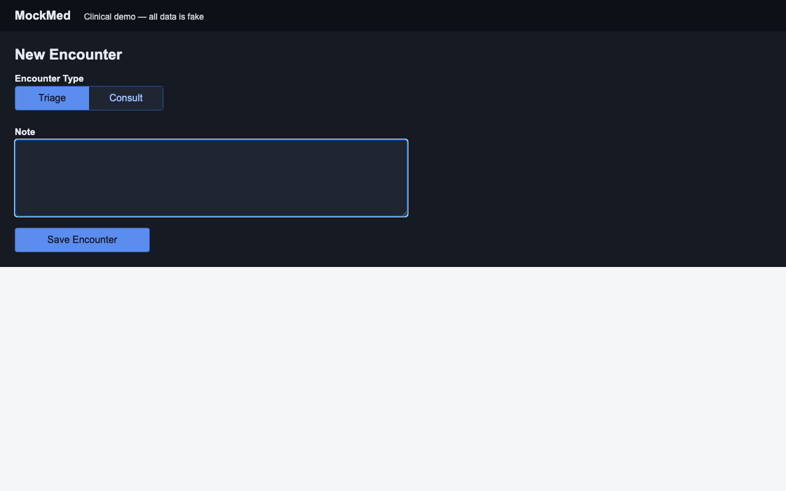 |  |

### 11. `step_010` — click 'Save Encounter' (final step, healed)

**Rung** `ocr` (conf 1.00, resolved (133, 391)) · **Gates** none on this step · **Heal** healed via `ocr` · **Outcome** ✅ ok

| Before | After |
| --- | --- |
|  | 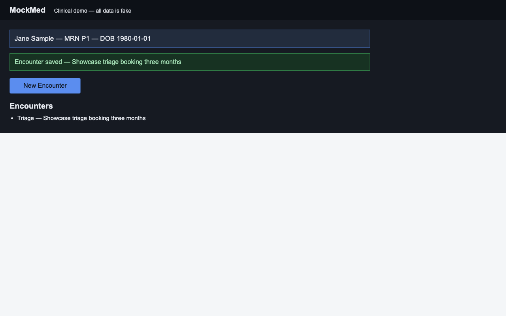 |

**Heal detail** (`anchor_refresh` via `ocr`, applied):

- anchor `templates/step_010.png` → `templates/step_010.png`

| Healed frame |
| --- |
|  |

## Rung histogram

| Rung | Count | |
| --- | --- | --- |
| `template` | 0 |  |
| `template_global` | 0 |  |
| `ocr` | 5 | █████ |
| `geometry` | 3 | ███ |
| `grounder` | 0 |  |

## Totals

| Metric | Value |
| --- | --- |
| Total time | 9694 ms |
| Steps ok | 11/11 |
| Heals | 8 |
| model_calls | 0 |
| est_model_cost_usd | $0.0000 |
