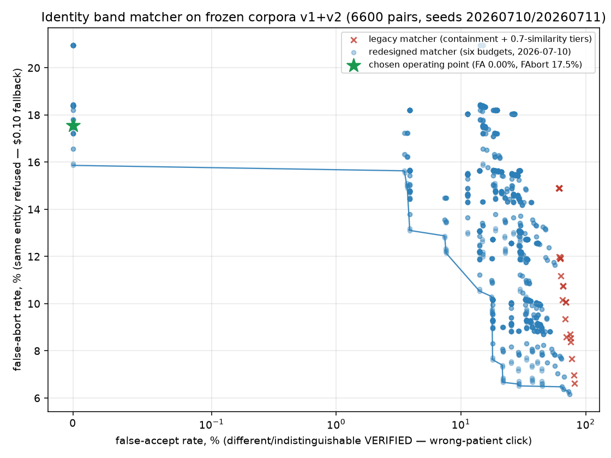

# Identity band matcher — held-out adversarial ROC (corpora v1+v2)

Generated by `python -m openadapt_flow.validation.identity_roc` from the FROZEN corpora: v1 (4360 pairs, seed 20260710) and v2 (2240 pairs, seed 20260711, the classes v1 excluded by construction), hash manifests committed before the matcher changes they evaluate. Do not edit by hand.

**Scope of every number below, stated plainly:** measured on corpus v1+v2 plus the 13 out-of-corpus reviewer probes (`tests/test_identity_out_of_corpus.py`) — not 'in the world'. The operating point is FIT TO THESE CORPORA: freezing the corpora before the matcher change prevents tuning the corpus toward the matcher, but nothing prevents the operating point from being tuned toward the corpora — v1's own 0.000% headline was shown partially tautological by the 2026-07-10 review (its labeling rule excluded confusion-collided names, short-token discriminators, observed supersets and absent-name shapes by construction). v2 exists because of that review; the same criticism applies to v2's zero one review later.

- **false accept** = a `different_entity` OR `indistinguishable` pair VERIFIED — a wrong-patient click, catastrophic in an EMR.
- **false abort** = a `same_entity` pair refused — one hybrid fallback (~$0.10) or a human retry.
- **justified abort** = an `indistinguishable` pair refused — the true row misread by a letter-letter confusion is textually identical to a real sibling (Neil misread as Nell vs an actual patient Nell), so ABORT is correct for BOTH readings and is never counted as a false abort.

## Chosen operating point

`contradiction_sim=0.62`, `coverage_threshold=0.8`, `uncovered_run_cap=4`, `contradicted_chars_cap=0`, `suspect_chars_cap=0`, `unexplained_name_tokens_cap=0`, `absent_name_token_cap=3` →
**false accept 0.000%, false abort 17.55%, indistinguishable-class abort 100.0%** across v1+v2.

Reference points at the same coverage/run/contradiction caps:

- legacy matcher (pre-rebuild tiers): FA 68.9% / FAbort 10.1%;
- the SHIPPED pre-review decision (new budgets off): FA 28.82% / FAbort 8.85% — every one of those false accepts is an out-of-corpus-review class (collision/short-token/superset/absent-name) that v1 could not see;
- per corpus at the production point: v1 FA 0.000% / FAbort 21.20%; v2 FA 0.000% / FAbort 0.00%, indistinguishable abort 100.0%.

**The weighting, out loud:** a false accept is a wrong-patient write on a real EMR — a clinical-safety event that downstream note verification does NOT catch (the note really is saved, in the wrong chart). A false abort costs one ~$0.10 hybrid-fallback escalation or a human retry. We price that asymmetry at four-plus orders of magnitude, so only zero-measured-false-accept points were considered, and the six budgets are kept independently strict (defense in depth) rather than taking the minimum-false-abort zero-FA corner. The availability price is real and stated in the tables below: the v1 false-abort rate rose from 10.7% (pre-review matcher) to 21.2% — concentrated in occlusion, letter-letter confusion noise (the indistinguishable mechanism), and capitalized adjacent-row bleed — because the review showed the cheaper operating point was buying availability with silent wrong-patient classes.

**Why not the cheaper zero-FA corner** (`coverage 0.85 / run_cap 8 / absent-name cap off`, FAbort 15.86% vs 17.55%): that corner disables the absent-name budget and relies on the coverage threshold (0.85) sitting just above the Major-4 probe's coverage (0.826 for 'Belford, Phil' -> 'Belford,'). The protection is an artifact of band length: the same absent 4-char name inside a longer band ('Montgomery-Winchester, Phil 1985-03-12 M MRN A482913' loses 'Phil' at coverage 0.915) clears the threshold and verifies with the identity token never read. The absent-name cap refuses structurally, independent of band length — that independence is what the extra +1.69% false aborts buy.

## The indistinguishable trade-off

The suspect rule cannot verify a letter-letter-collided name and cannot distinguish a misread from a sibling — nobody can, at band level: the bands are textually identical. The price of refusing the Neil/Nell sibling (Blocker 1) is refusing the true row whenever OCR letter-letter-garbles a name token:

- v2 `confusion_misread_true_row` (all 200 labeled indistinguishable): 100.0% abort — correct for both readings, counted as justified;
- v1 `ocr_confusion` / `compound_noise` false aborts (32.5% / 38.3%) are dominated by the same letter-letter shapes (v1 labels them same_entity because its generator KNOWS it applied noise; the matcher cannot know that, and treating them as verifiable is exactly the Blocker-1 hole).

## Occlusion recount (correcting the earlier framing)

The earlier IDENTITY_ROC.md claimed occlusion false-aborts were 'bands whose identity tokens were not read at all — refusing is the correct epistemic outcome'. The reviewer measured otherwise and this recount confirms it:

- shipped decision: 216/240 occlusion aborts, of which **102** still had BOTH name tokens readable (the abort was trailing DOB/MRN loss, not unreadable identity);
- production decision: 224/240 aborts, **107** with both name tokens readable.

So roughly half of the occlusion aborts are a plain availability cost on rows whose name WAS readable — kept because a band that lost its trailing discriminators (DOB/MRN) retains only the name, and the name alone is exactly the surface the collision classes attack. That is a priced trade-off, not an epistemic virtue.

## Realistic-exposure analysis (Blocker 1 shapes)

The reviewer's Blocker-1 probes carried IDENTICAL MRN/DOB on different patients — unrealistic (MRNs are unique), and useful precisely to isolate the name-matching hole. On realistic shapes, what catches the wrong row if the suspect rule is disabled?

| collision class | n | FA at production | FA without the suspect rule |
| --- | --- | --- | --- |
| ids differ (realistic distinct patients) | 180 | 0 | 0 |
| ids identical (probe shape) | 180 | 0 | 180 |
| name is the ONLY discriminative token | 180 | 0 | 180 |

Reading: when a collided pair has differing, readable DOB/MRN, the absence/contradiction budgets catch 180/180 even without the suspect rule. The TRUE residual exposure is the band where the name is the only discriminative token: there the suspect rule is the only defense, and it defends only against collisions INSIDE the frozen confusion table. An exotic misread pair outside the table, a collision by case/whitespace only, or the 'Ann Marie'/'Annmarie' token-join equivalence remain verifiable — disclosed in docs/LIMITS.md.

## Error rates by generator category (at the production decision)

### Corpus v1

| category | label | legacy matcher | redesigned matcher |
| --- | --- | --- | --- |
| `adjacent_row_mixture` | false accept | 0.0% | 0.0% |
| `dob_off_by_one_field` | false accept | 99.1% | 0.0% |
| `generational_suffix` | false accept | 99.1% | 0.0% |
| `mrn_digit_swap` | false accept | 50.0% | 0.0% |
| `prefix_extension` | false accept | 72.3% | 0.0% |
| `same_first_diff_surname` | false accept | 9.1% | 0.0% |
| `same_surname_diff_first` | false accept | 15.5% | 0.0% |
| `shared_clinical_text` | false accept | 0.5% | 0.0% |
| `single_letter_edit` | false accept | 98.2% | 0.0% |
| `transposition` | false accept | 95.5% | 0.0% |
| `case_whitespace` | false abort | 0.0% | 0.0% |
| `compound_noise` | false abort | 16.7% | 38.3% |
| `dropped_short_tokens` | false abort | 0.4% | 0.8% |
| `occlusion` | false abort | 89.6% | 93.3% |
| `ocr_confusion` | false abort | 2.5% | 32.5% |
| `reordered_segments` | false abort | 0.0% | 0.0% |
| `spurious_tokens` | false abort | 0.0% | 25.8% |
| `token_join` | false abort | 0.0% | 0.0% |
| `token_split` | false abort | 0.0% | 0.0% |

### Corpus v2

| category | label | legacy matcher | redesigned matcher |
| --- | --- | --- | --- |
| `absent_name_token` | false accept | 95.3% | 0.0% |
| `confusion_collision_ids_differ` | false accept | 0.0% | 0.0% |
| `confusion_collision_ids_same` | false accept | 95.0% | 0.0% |
| `confusion_collision_name_only` | false accept | 93.9% | 0.0% |
| `middle_initial` | false accept | 100.0% | 0.0% |
| `sex_column` | false accept | 100.0% | 0.0% |
| `superset_appended_name` | false accept | 100.0% | 0.0% |
| `superset_merged_row` | false accept | 100.0% | 0.0% |
| `superset_title_mention` | false accept | 100.0% | 0.0% |
| `two_char_name` | false accept | 100.0% | 0.0% |
| `confusion_misread_true_row` | false accept (verify on indistinguishable) | 90.5% | 0.0% |
| `adjacent_bleed_lowercase` | false abort | 0.0% | 0.0% |
| `digit_confusion_true_row` | false abort | 0.7% | 0.0% |
| `hyphenated_split` | false abort | 0.0% | 0.0% |

## Pareto frontier (redesigned matcher, v1+v2)

| sim | coverage | run_cap | contra | suspect | name | absent-alpha | false accept | false abort |
| --- | --- | --- | --- | --- | --- | --- | --- | --- |
| 0.75 | 0.85 | 8 | 0 | 0 | 0 | off | 0.000% | 15.86% |
| 0.62 | 0.8 | 8 | 0 | 0 | 0 | off | 3.509% | 15.63% |
| 0.75 | 0.8 | 8 | 0 | 0 | 0 | off | 3.534% | 15.56% |
| 0.62 | 0.7 | 8 | 0 | 0 | 0 | off | 3.684% | 14.98% |
| 0.75 | 0.7 | 8 | 0 | 0 | 0 | off | 3.709% | 14.90% |
| 0.75 | 0.85 | 8 | 0 | 0 | 1 | off | 3.885% | 13.10% |
| 0.62 | 0.8 | 8 | 0 | 0 | 1 | off | 7.393% | 12.87% |
| 0.75 | 0.8 | 8 | 0 | 0 | 1 | off | 7.419% | 12.80% |
| 0.62 | 0.7 | 8 | 0 | 0 | 1 | off | 7.569% | 12.22% |
| 0.75 | 0.7 | 8 | 0 | 0 | 1 | off | 7.594% | 12.15% |
| 0.75 | 0.85 | 8 | 0 | off | 0 | off | 14.035% | 10.54% |
| 0.62 | 0.8 | 8 | 0 | off | 0 | off | 17.544% | 10.31% |
| 0.75 | 0.8 | 8 | 0 | off | 0 | off | 17.569% | 10.23% |
| 0.62 | 0.7 | 8 | 0 | off | 0 | off | 17.719% | 9.66% |
| 0.75 | 0.7 | 8 | 0 | off | 0 | off | 17.744% | 9.58% |
| 0.75 | 0.85 | 8 | 0 | off | 1 | off | 17.920% | 7.62% |
| 0.62 | 0.8 | 8 | 0 | off | 1 | off | 21.429% | 7.39% |
| 0.75 | 0.8 | 8 | 0 | off | 1 | off | 21.454% | 7.32% |
| 0.62 | 0.7 | 8 | 0 | off | 1 | off | 21.604% | 6.74% |
| 0.75 | 0.7 | 8 | 0 | off | 1 | off | 21.629% | 6.67% |
| 0.62 | 0.7 | 8 | 0 | off | off | off | 28.997% | 6.59% |
| 0.75 | 0.7 | 8 | 0 | off | off | off | 29.023% | 6.51% |
| 0.62 | 0.75 | 8 | off | off | 1 | off | 64.687% | 6.48% |
| 0.75 | 0.75 | 8 | off | off | 1 | off | 64.687% | 6.48% |
| 0.62 | 0.7 | 8 | off | off | 1 | off | 66.216% | 6.36% |
| 0.75 | 0.7 | 8 | off | off | 1 | off | 66.216% | 6.36% |
| 0.62 | 0.75 | 8 | off | off | off | off | 72.356% | 6.28% |
| 0.75 | 0.75 | 8 | off | off | off | off | 72.356% | 6.28% |
| 0.62 | 0.7 | 8 | off | off | off | off | 73.885% | 6.17% |
| 0.75 | 0.7 | 8 | off | off | off | off | 73.885% | 6.17% |

Raw sweep data: `identity_roc.json`. The operating point is pinned by boundary tests in `tests/test_identity.py`; the sibling probes and the 13 out-of-corpus reviewer probes are pinned as permanent mismatches in `tests/test_identity.py` and `tests/test_identity_out_of_corpus.py`.
